# CDF Labs: Real-time Web Click Stream Data analysis with NiFi, Kafka, Druid, Hive, Zeppelin and Superset


## Prerequisites

**Although this AMI is not public and is available for Cloudera workhops only, the steps can be reproduced in your own environment**

- Launch AWS AMI 
  - **New: ami-0a07d72cfdae70482**
  - Use **m5d.4xlarge** instance type
  - Keep default storage (300GB SSD)
  - Set security group with:
    - Type: All TCP
    - Source: My IP
  - Choose an existing or create a new key pair

## Content

* [Setup for Accessing the sandbox](#Setup-for-Accessing-the-sandbox)
* [Workshop Overview](#Workshop-Overview)   
   
* [Lab 1 - Build the first NiFi flow](#Lab-1---Build-the-first-NiFi-flow)
* [Lab 2 - Process Data and Integrate with Schema Registry](#Lab-2---Process-Data-and-Integrate-with-Schema-Registry)
* [Lab 3 - Explore Zeppelin and Hive](#Lab-3---Explore-Zeppelin-and-Hive)
* [Lab 4 - Enrich Clickstream Events with User Information for Downstream Analysis](#Lab-4---Enrich-Clickstream-Events-with-User-Information-for-Downstream-Analysis)
* [Lab 5 - Explore Kafka](#Lab-5---Explore-Kafka)
* [Lab 6 - Publish Enriched Clickstream Events to Kafka and ingest into Druid](#Lab-6---Publish-Enriched-Clickstream-Events-to-Kafka-and-ingest-into-Druid)
* [Lab 7 - Ingest clickstream_events into Druid](#Lab-7---Ingest-clickstream_events-into-Druid)
* [Lab 8 - Create Live Dashboard with Superset](#Lab-8---Create-Live-Dashboard-with-Superset)
* [Lab 9 - Collect clickstream events data using MiNiFi and EFM](#Lab-9---Collect-clickstream-events-data-using-MiNiFi-and-EFM)
* [Bonus - Lab 10 - Stream enhanced data into Hive using NiFi](#Bonus---Lab-10---Stream-enhanced-data-into-Hive-using-NiFi)

## Setup for Accessing the sandbox

### Add an alias to your hosts file

On Mac OS X, open a terminal and vi /etc/hosts

On Windows, open C:\Windows\System32\drivers\etc\hosts

Add a new line to the existing

```nnn.nnn.nnn.nnn	demo.cloudera.com```

Replacing the ip (nn.nnn.nnn.nnn) address with the one provided

If you can't edit the hosts file due to lack of privileges, then you will need to replace the reference to demo.cloudera.com alias with the instance private ip wherever it's used by a NiFi processor.

To get this private ip, ssh to the instance and type the command ```ifconfig```, the first ip starting with 172 is the one to use:


### Start all HDP and CDF services

**They should be already started**

Open a web browser and go to the following url

```http://demo.cloudera.com:8080/```

Log in with the following credential

Username: admin
Password: admin

If services are not started already, start all services


It can take up to 20 minutes...


### SSH to the sandbox

**Copy and paste** (do not download) the content of [ppk](keys/WI-HDF-WORKSHOP-KEYS.ppk) for Windows or [pem](keys/WI-HDF-WORKSHOP-KEYS.pem) for Mac OS X

On Mac use the terminal to SSH

For Mac users, don't forget to ```chmod 400 /path/to/hdp-workshop.pem``` before ssh'ing


On Windows use [putty](https://www.chiark.greenend.org.uk/~sgtatham/putty/latest.html)


## Workshop Overview
In these labs while exploring the Cloudera Platform technologies, we are going to build a Web Click Stream Analytics Application that will allow us to monitor the products that our customers or web site visitors are most interested in. For this we are going to assume that we are a financial institution that exposes its financial products to its customers as well as general public and will monitor the interest in the products advertised through our website.

While this example is for a financial institution, this use case in general is applicable in any vertical including retail and other consumer oriented businesses. The monitoring aspect of the interest in the products could generally be for understanding the consumer behavior for the products or also for understanding the efficacy of a marketing campaign for new products or for promotions of existing products through a website. The insights derived from real-time monitoring and notifications can be leveraged for making decisions in real-time on which products to focus the most or which segment of the consumers to target the most. Analysis of many such scenarios become feasible when you have the right information at the right time, particularly in real-time so that you can take pro-active actions in real-time. 

In order to have a web-click stream data source available for our workshop, we are going to make use of a script that will simulate the web application and generate web-clicks streaming data. We will capture that data via **NiFi**, filter appropriate events for routing purposes, process it where required, and forward it to downstream applications via **Kafka** for further analysis. We will ingest the data into **Druid**. **Druid** provides us the capabilities to execute queries on streaming data in real-time. To visualize data and run queries in real-time, we will use **Superset** to build our real-time dashboards.

Since the sandbox for the labs was built using **HDP/CDP** and **HDF/CDF** platforms, we will also use **HDFS** to store our data files, **Hive** to build our database and tables on top of those data files. We will make use of these tables in our NiFi flows for enriching clickstream_events in flight, with user and product data. For interacting with HDFS and Hive, we will make use of **Zeppelin**.


**TODO: Image of the overall architecture.**

****
## Lab 1 - Build the first NiFi flow

Let's get started... Open [NiFi UI](http://demo.cloudera.com:9090/nifi/) and follow the steps below:


- **Step 1:** Drag on drop a Process Group on the root canvas and name it **CDF Workshop**


- **Step 2:** Go to [NiFi Registry](http://demo.cloudera.com:61080/nifi-registry/explorer/grid-list) and create a new bucket
  - Click on the little wrench icon at the top right corner
  - Click on the **NEW BUCKET** button
  - Name the bucket **workshop**
  


- **Step 3:** Go back to NiFi UI and right click on the previously created process group
  - Click on Version > Start version control
  - Then provide at least a Flow Name - clickstream-flow
  - Click on Save
  
  This will put your process group in version control. As you build your flows by adding processors, you can persist them from time to time in the flow registry for version control.

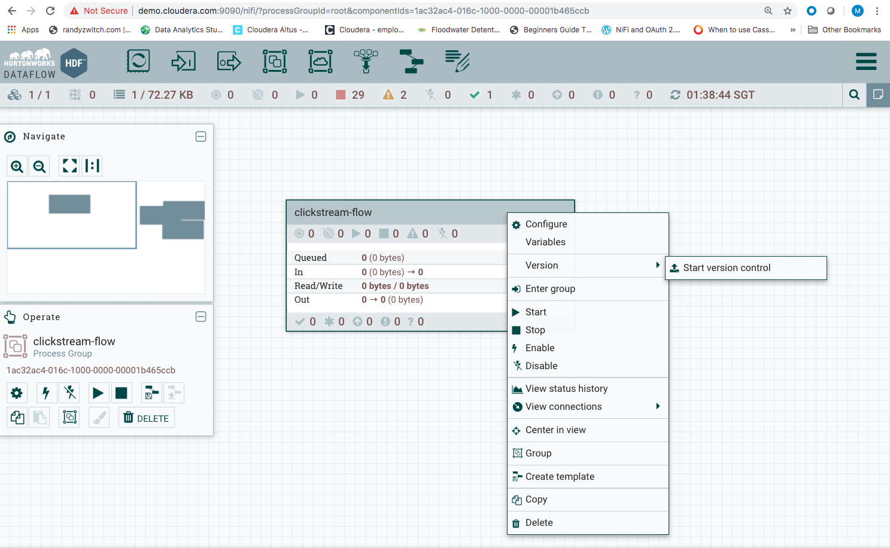

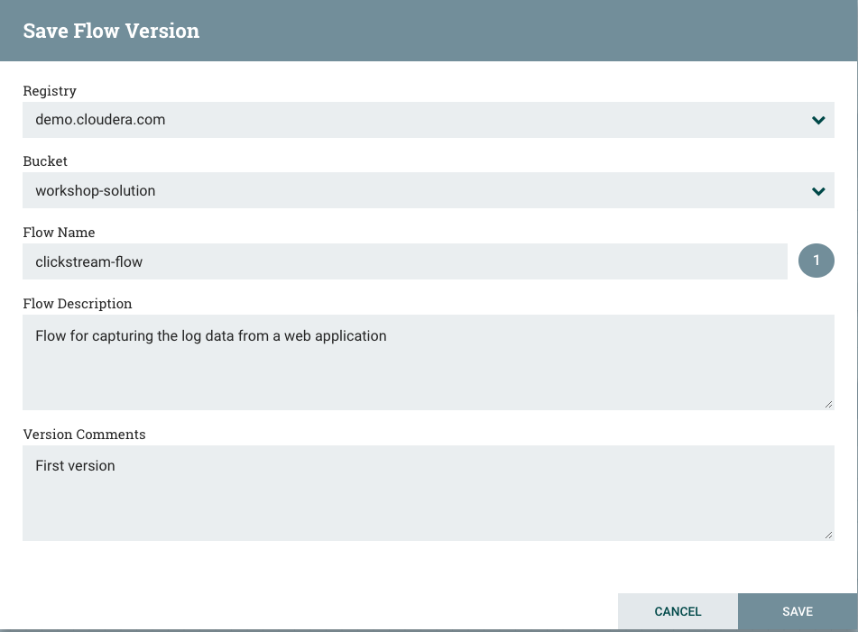


- **Step 4: Explore the web-app simulator script**  

   We will now gradually build the process flow to capture web logs. Since we dont have a real web application, we are going to use a web-application simulator that will generate the log files. Let us explore how this simulator works first. Follow the below steps:  
  - SSH into your instance.
  - cd to `/home/centos/cdf-workshop-master/data_gen Directory`
  - There are  3 scripts here as shown below:
	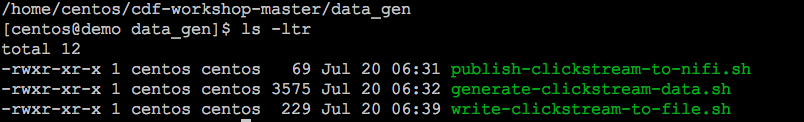
  - `generate-clickstream-data.sh`: This is the main script. It reads the data from the `/home/centos/cdf-workshop-master/data/filtered-omniture-raw.tsv` file. This file is a real log data fiel from a web application. It uses this file but replaces the urls with randomly generated urls that are provided in the `products.tsv` file. You can change the list of urls here to reflect any product you want simulated. For our labs, we are simulating these web logs are for a financial institution that have financial products. Open up the two files and explore the data content in them.  
  Execute the  `generate-clickstream-data.sh` script and see what kind of data is generated by typing `./generate-clickstream-data.sh`.
  - `publish-clickstream-to-nifi.sh` : This script uses the `generate-clickstream-data.sh` to publish the same data to a tcp socket. You can control the speed at which this data is generated by providing arguments like `0.5, 1.0m,etc`. The 's', 'm' are the units for seconds and minutes. with no units, the number will be treated as seconds. For our initial data flow in NiFi, **we are going to use this script to publish to a NiFi TCPListen processor.** You can execute this script and see what it does. 
  - `write-clickstream-to-file.sh` : This script writes the output to a file in the "../data/weblogs" directory in a file called "weblogs.log". **We will use this file later to have minifi capture the logs written to this file and publish it over to NiFi.**  


- **Step 5: Configure a ListenTCP Processor**  
 
  Get into the CDF Workshop process group (double click on the process group).  
  - Drag a **ListenTCP** processor to the canvas
  - Double click on the processor
  - On settings tab, change the **Name** parameter value to **Listen for clickstream log events**
  - On properties tab, change **Port** value to **9797**
  - You can hover on the **?** icon by each property value to see what they are for, but leave the default values as they are.
  - Apply changes
  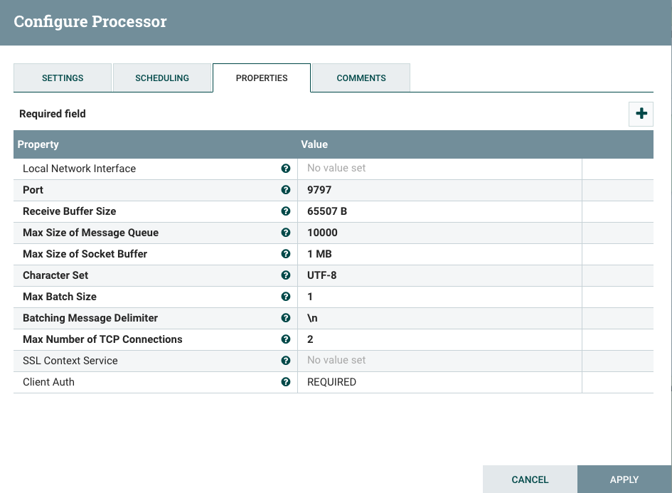
  - Drag the **funnel icon** from the menu bar at the top on the canvas.
  - Connect the **ListenTCP** processor to the **funnel icon**. A **Create Connection** icon pops up with the **success** box checked. Accept the default and click on the **Add button*
  - The **funnel** is used to typically to collect flowfiles from different connections. However we are using it here as a place-holder for future flows and to collect the data that comes in from the **ListenTCP Processor** and send that data to the intermediate queue to help explore the data as it comes in.
  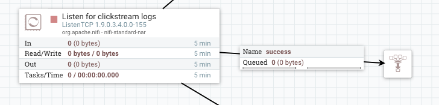
  
   - Start the processor by righ-clicking on the processor and clicking on the **start** menu item. This will start the processor and it will now listen on the port **9797** for incoming packets.
   - Go back to your command prompt window and now execute the publish-clickstream-to-nifi.sh script by executing the following command.
    `./publish-clickstream-to-nifi.sh 1`. 
   You will now see that the script executes and does not error out since it is now able to connect to the **ListenTCP** processor and send the data packets over.
   - Within your NiFi flow, you should now see data coming in and the messages in the queue connection piling up.
   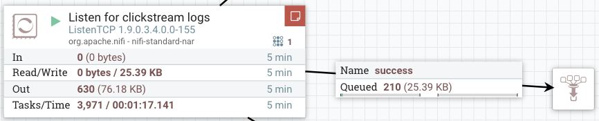
   - Stop the **publish-clickstream-to-nifi.sh** script by using **CTL-C**. 

- **Step 6: Explore data in queue**  
 
  We are now going to explore what came into the ListenTCP processor and how this data is now available from the queue connection we created between the processor and the funnel.  
  - Right click on the **success queue** and from the context menu, select **List Queue** item. 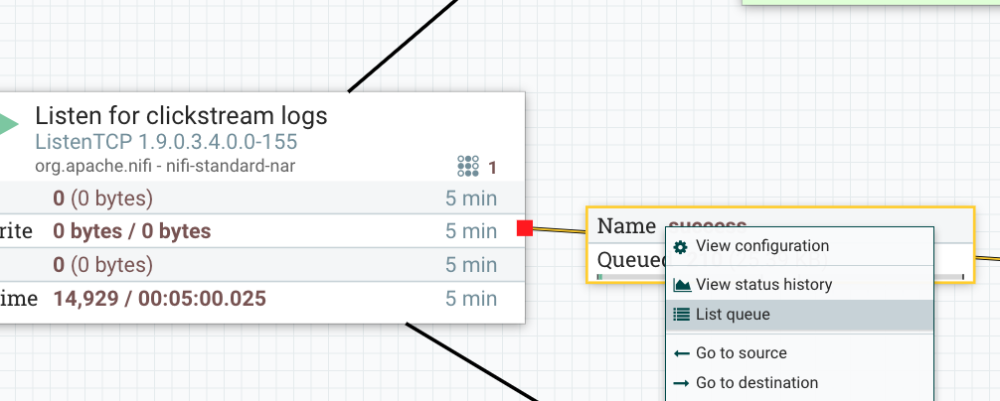
  - This will open up a window showing all the flowfiles that were received by the **ListenTCP** processor and forwarded to the connection queue. 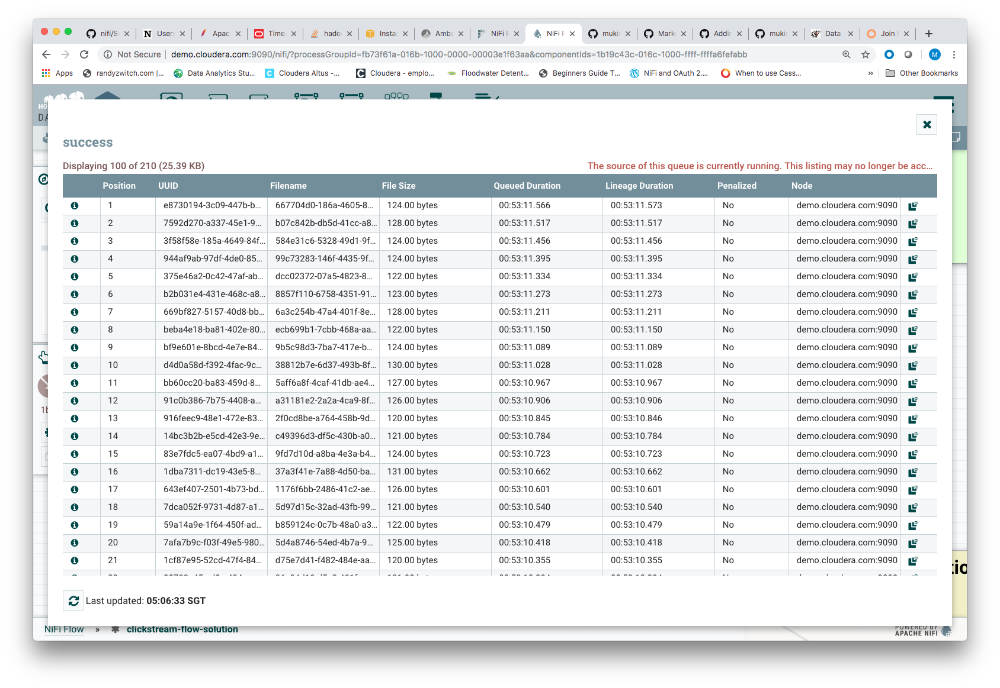
  - Select the "info icon in the first column", This will open up the a window to show the corresponding flow file details. Observe some of the attributes on the **DETAILS** tab. Each flowfile has a unique id associated with that and a unique filename given to it. Also shows the size of the file. You can download the contents of the file to your computer by clicking on the **Download Button** or click on the **View Button** to view what was received. 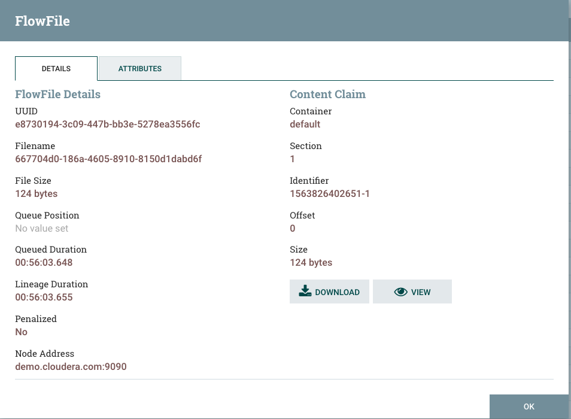
  - Click on the **View Button** and you will see the contents in another tab of your browser window that pops up. Keep this window open for using later. 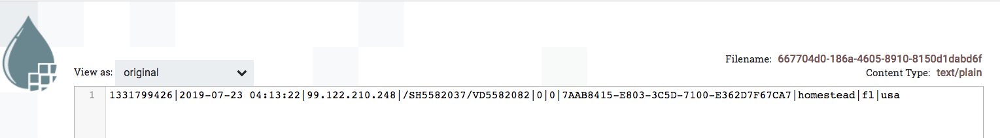
  - Go back to your **FlowFile** details window. Click on the **ATTRIBUTES** tab. This provides the details of the attributes that are associated with the flow file. Click OK and close the queue list window to return back to your canvas. 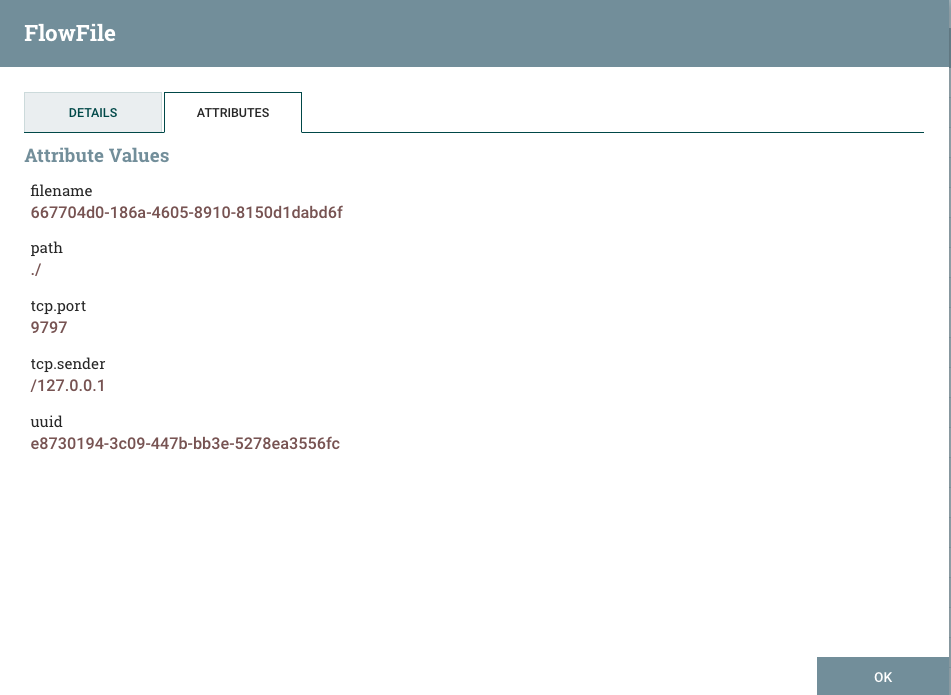

****  
## Lab 2 - Process Data and Integrate with Schema Registry
In this lab, we will further enrich and process content that was received from the log generator simulating a web click stream.

We will perform the following steps to continue to build our flow:


- **Step 1: Configure the UpdateAttribute NiFi Processor**  
To reference the name of the schema in the registry that will be used for processing content within our flows, we will configure an UpdateAttribute processor.  
  - Drag an UpdateAttribute to the canvas.
  - On the **SETTINGS** tab, change the Name to "*Set Schema Name from Registry*"
  - On the **PROPERTIES** tab, click on the "+" button on the top-right side of the window and an attribute. Set the values as follows:    
    - Property Name: schema.name
    - Property Value: clickstream_event 
  - Click OK, APPLY and close the processor properties.
  - Connect the "*Listen for clickstream logs*" processor to this processor, using the "*success*" relationship. A connection queue will show up on the connection line joining the two processors.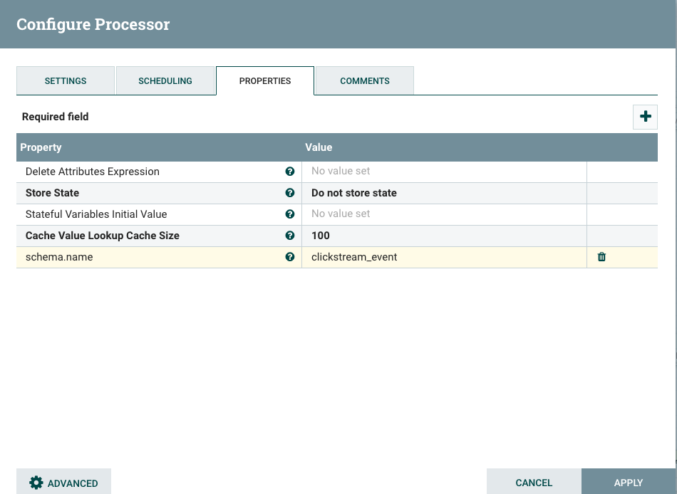
  

  
 - **Step 2: Define clickstream_events schema and register with Schema Registry**  
To be able to parse the data received from the clickstream log events, we will need to defined a data structure that can be referenced by various services to parse or serialize and de-serialize the data when required.  For this we will define a schema called **clicstream_event** and persist into the schema registry.   


   Explore [Schema Registry UI](http://demo.cloudera.com:7788/)   

   Create a new Avro Schema, hitting the plus button, named **clickstream_event** with the following Avro Schema. You an copy and paste the schema in the **SCHEMA TEXT** window. Fill in the other values as shown in the figure below:   

```
{
 "type": "record",
 "namespace": "cloudera.workshop.clickstream",
 "name": "clickstream_event",
 "fields": [
  {
   "name": "clickstream_id",
   "type": "string"
  },
  {
   "name": "timestamp",
   "type": [
    "null",
    "string"
   ]
  },
  {
   "name": "IPaddress",
   "type": [
    "null",
    "string"
   ]
  },
  {
   "name": "url",
   "type": [
    "null",
    "string"
   ]
  },
  {
   "name": "is_purchased",
   "type": [
    "null",
    "string"
   ]
  },
  {
   "name": "is_page_errored",
   "type": [
    "null",
    "string"
   ]
  },
  {
   "name": "user_session_id",
   "type": [
    "null",
    "string"
   ]
  },
  {
   "name": "city",
   "type": [
    "null",
    "string"
   ]
  },
  {
   "name": "state",
   "type": [
    "null",
    "string"
   ]
  },
  {
   "name": "country",
   "type": [
    "null",
    "string"
   ]
  }
 ]
}
```   

      

   You should end up with a newly versioned schema as follow:   
   
   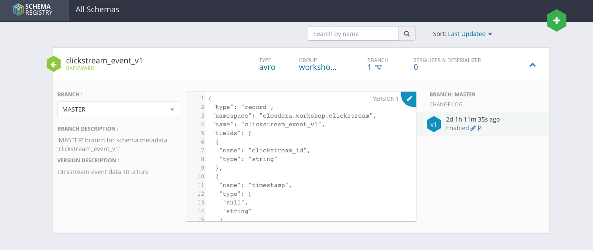   

   Explore the [REST API](http://demo.cloudera.com:7788/swagger) as well. You can use these APIs to perform various actions on the schemas.   

   Additionally you can explore by clicking on the *Edit* and *Fork* the features they provide for maintaining the schemas along with publishing the new versions for general consumption by other flows or services. (*Note: Ignore the name of the schmea showing up as clickstream_event_v1 in the images.*)
  
 - **Step 3: Configure a SplitRecord Procesor**
   
In this step, we will configure a **SplitRecord** processor. There are two reasons for this:     
   (1) to be able to split the content received into individual records. The content received over ListenTCP processor can have multiple records coming in one data flow file depending on the speed of the streaming data as well as the size of the buffer configured.   
   (2) Convert the data format into a format required for further processing or delivering it to a destination.   

   The data coming in is in the pipe delimited format. We will convert it into json format so we can extract the data we need using another processor in the next step.    

   - Drag the **SplitRecord** processor on the canvas and perform the following steps:    
     - On the **PROPERTIES** tab    
        - *RecordReader*: Click on **CreateNewService** in the dropdown and select **CSVReader**
        - *RecordWriter*: Click on the **CreateNewService** in the dropdwon and select **JsonRecordSetWriter**
        - *Records Per Split*: 1
        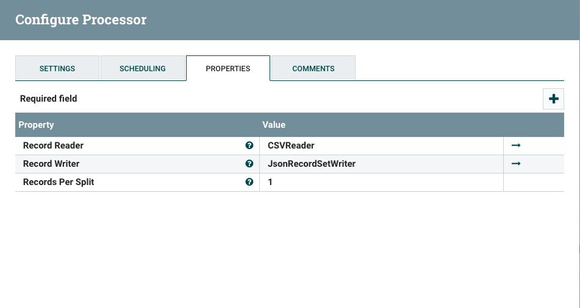
        - **Configure CSVReader Controller Service** Click on arrow next to CSVReader. It will ask you to save the configurations, which you can accept. It will then take you to the **CONTROLLER SERVICES** window. Click on the **Gear** icon. 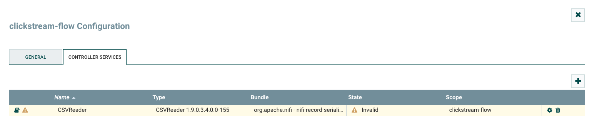.   
        
        This will take you to the CSVReader's configuration window. Select the **PROPERTIES** tab.   
                 
        - Set the following properties as below (see the images for the configs below):   
           - *Schema Access Strategy*: *Use 'Schema Name' Property*
           - *Schema Registry*: Select *'create new service'* and select **HortonworksSchemaRegistry** from the dropdown.
           - *Schema Name*: $(schema.name)   
           - *Value Separator*: | 
        
           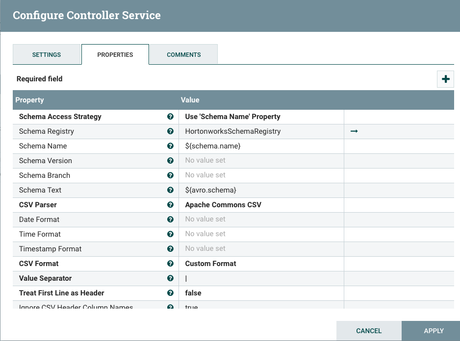
           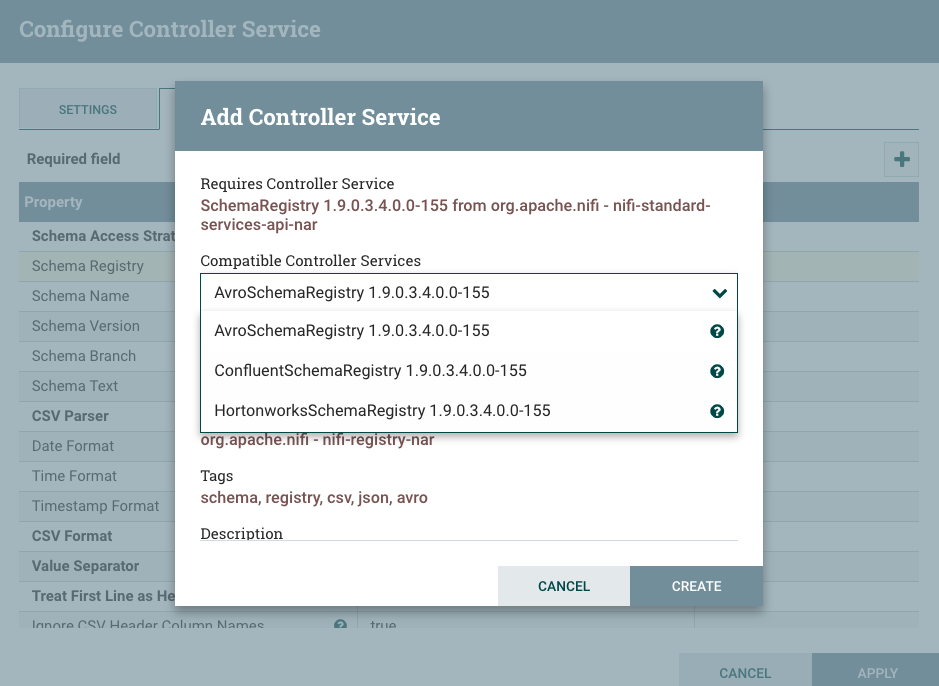   
           - Click **APPLY** and get out of the CSVReader Configuration Window.   
           
           - **Configure JsonRecordSetWriter Controller Service** From the Controller Service window (or by clicking on arrow next to JsonRecordSetWriter service, if you closed it). Click on the **Gear** icon.
           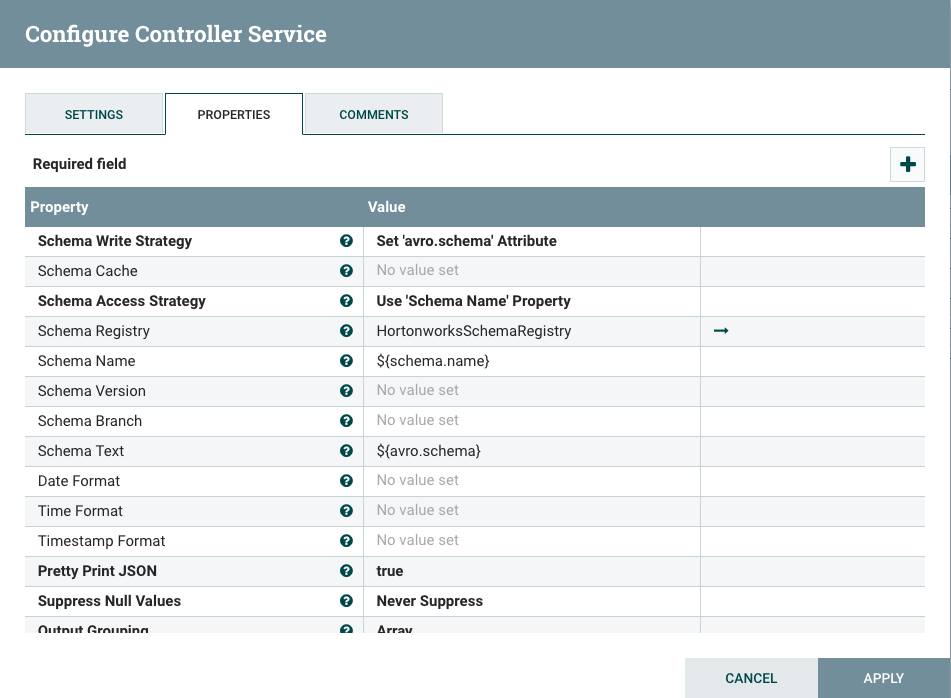.   
        
        This will take you to the JsonRecordSetWriter's configuration window. Select the **PROPERTIES** tab.   
         
        - Set the following properties as below (see the images for the configs below):   
           - *Schema Write Strategy*: *Set 'avro.schema' Attribute*
           - *Schema Access Strategy*: *Use 'Schema Name' Property*
           - *Schema Registry*: select **HortonworksSchemaRegistry** from the dropdown.
           - *Schema Name*: $(schema.name)   
           - Leave the rest as defaults and Click **APPLY** and get out of the JsonRecordSetWriter Configuration Window. Close the Controller Services Window.   
                          
      - On the **SplitRecord** configuration **SETTINGS** tab  
        - Check the *failure* and *original* check boxes.   
        - Click **APPLY** and close the processor configuration window.
      - Connect the **UpdateAttribute** processor with the **SplitRecord** Processor for the **success** path.
      - Configure **HortonworksSchemaRegistry** controller service. Click on the canvas anywhere (not on a processor!) in the process group you are working. Click on the Gear icon in the **Operate** window on the left side. This will open up a configuration window for the process group. Click on the **CONTROLLER SERVICES** tab. Click on the **HortonworksSchemaRegistry** controller service gear icon. This will open up the configuration window for the service. Set the attribute values as follows:
        - **Schema Registry URL** : http://demo.cloudera.com:7788/api/v1
        - leave the rest of the default settings. Click ok and exit out of the configuration window. Exit out of the controller services window. 
        
        
 - **Step 4: Configure a EvaluateJsonPath Procesor**
In the previous step, our processor will convert the CSV (pipe delimited) format into a json object. In this step, we will extract values from the flow file content and assign those values to flow file attributes that we will create.   

Drag a **EvaluateJsonPath** processor to the canvas and perform the following configurations by double clicking on the processor.

   - On the **PROPERTIES** tab, add the following attributes by clicking on the "+" button on the upper right hand corner of the window and assign values as below (please see the image below for help).    
      - **city** : *$.city*
      - **clickstream_id** : *$.clickstream_id*
      - **country** : *$.country*
      - **IPaddress** : *$.IPaddress*
      - **is_page_errored** : *$.is_page_errored*
      - **is_purchased** : *$.is_purchased*
      - **state** : *$.state*
      - **ts** : *$.timestamp*
      - **url** : *$.url*
      - **user_session_id** : *$.user_session_id*      
      
      Set the other other properties as follows and leave the rest as defaults:
      - **Destination** : *flowfile-attribute* 
      
   - On the **SETTINGS** tab, 
   	  - Check the *failure* box.
   	  - **Name** : *Extract JSON values into attributes*
   	  
   - Click **APPLY** and close the processor configuration window.
      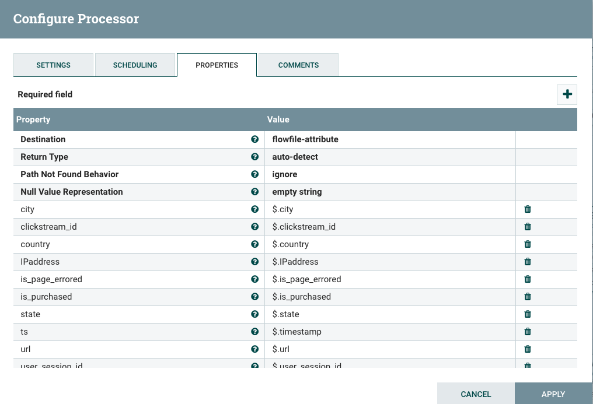
   
   - Connect the **SplitRecord** processor to the **EvaluateJsonPath** processor using the **splits** path.
   - Move the *funnel* connection from **ListenTCP** connection to **EvaluateJSONPath**, by accepting both the *matched* and *unmatched* paths to the funnel. Your nifi flow will look something like below.
   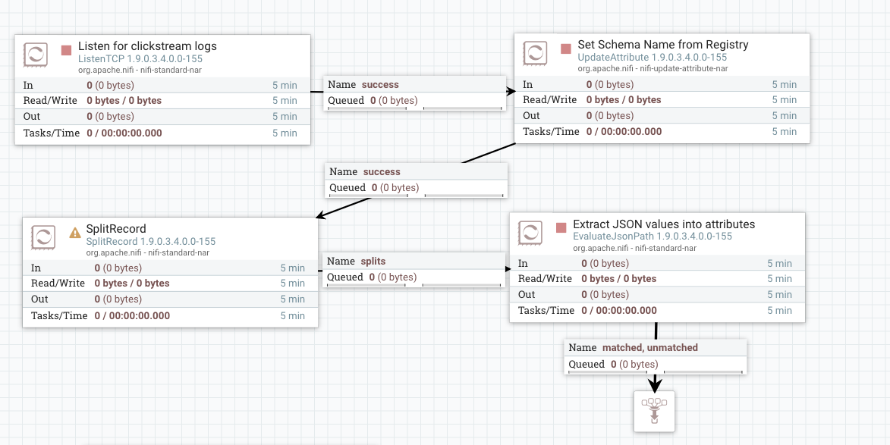
   
   
 - **Step 5: Test the Flow**   
We will now test the flow. Perform the following steps to start the controller services. 
   
   - Click on the canvas within the process group where you are building the NiFi flow to get the context to the process group. In the **Operate** window at the right side of the canvas, click on the **Gear** icon. This will take you to the controller services window.   
   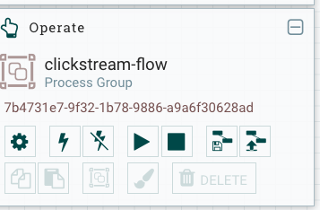   
   
   - Start the **HortonworksSchemaRegistry**, **CSVReader** and **JsonRecordSetWriter** services by clicking on the **bolt** icon on the right side (need to start HortonworksSchemaRegistry service first). 

   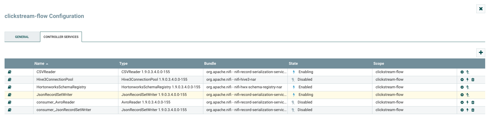

   - Start the NiFi Flow by right clicking in the canvas anywhere. This will start all the processors. If you see any processor with a red top corner, it means your processor configurations have errors. You will need to fix the configurations for those processors. You can also start each individual processor by right-clicking on each processor.
   
   - Start the 'publish-clickstream-to-nifi.sh' script from your ssh terminal. This will start publishing log events to the ListenTCP processor and the events will now flow to the other processors. 
   
   - You can see the processed data at each stage now. Go to the connection queue before the funnel and right-click for the context menu. Select 'List Queue' option. 
   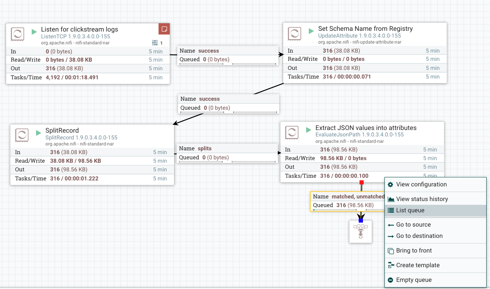
   
   - Select the first row and click on the info icon. 
   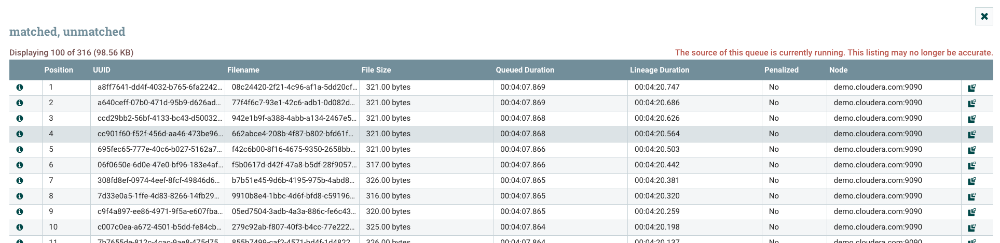
   
   - In the flow-file window that pops up, on the **DETAILS** tab, click on the **VIEW** button. You will see the data that was originally sent in the pipe delimited format, is now transformed into json format.
   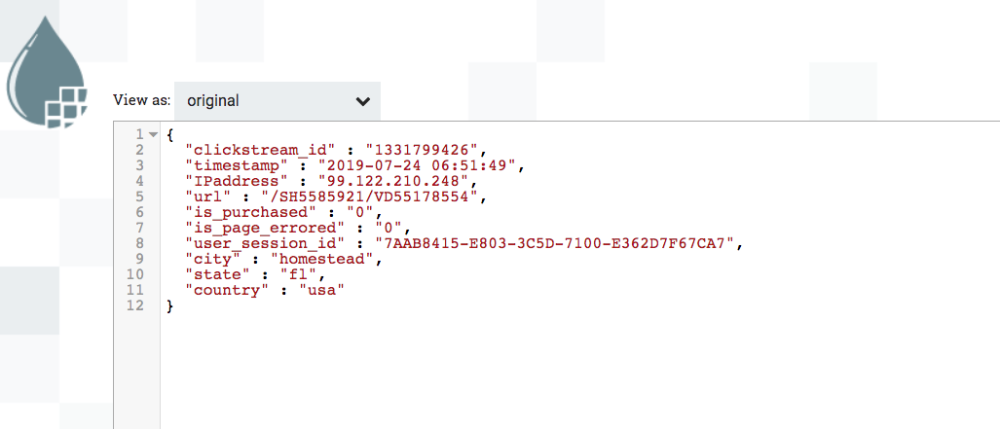
   
   - Click on the **ATTRIBUTES** tab. You will see all the attributes that were defined in the **EvaluateJsonPath** processor are now populated with the right values.
   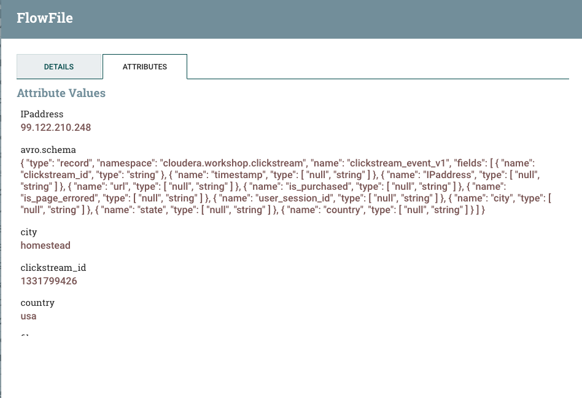
   
   - If you have the process flow working this far, you should save the flow in the Flow Registry. Right-click on the canvas, click on **Version** from the options menu, then click on **Commit local changes**.
   
   
   - Provide the version comments in the window that pops up and click on **SAVE**. When you go up one-level outside your process group, to the main canvas, you will see your process group has a green tick mark on it, indicating that the process group is now being versioned in the nifi flow registry.
   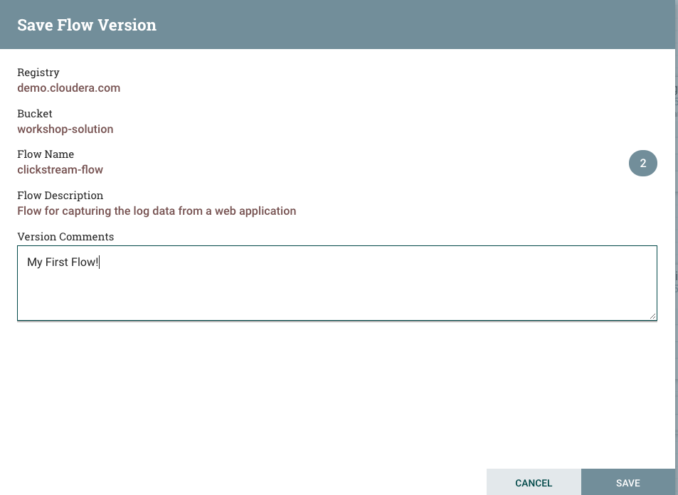
   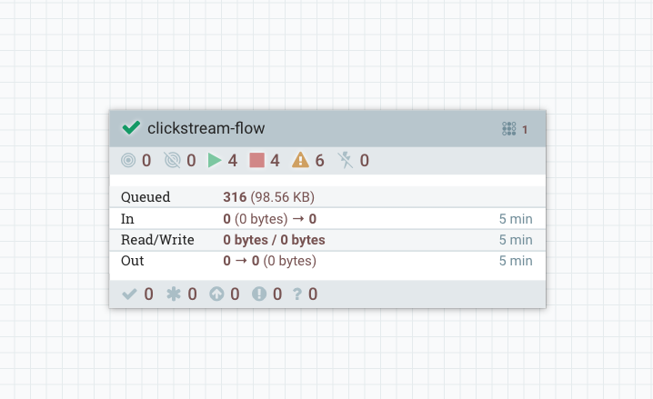
   
   - Open up NiFi Registry UI : http://demo.cloudera.com:61080/nifi-registry. You can see your flow shows up in registry.
   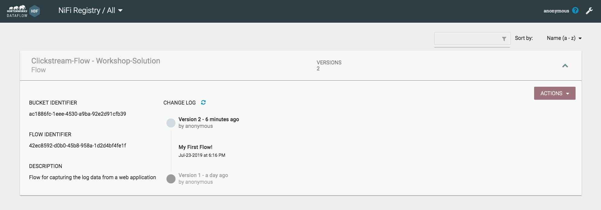
     
   - You have now successfully completed this lab.
   
****  
## Lab 3 - Explore Zeppelin and Hive
In this lab we will explore the HDP platform's HDFS and Hive components using Zeppelin.
Zeppelin is a notebook application that provides an interactive environment to create notebooks using many scripting languages for which interpreters are available. Graphically rich applications can be created using notebooks and the scripting programming languages the user is familiar with.


  - Log into Zeppelin [Zeppelin](http://demo.cloudera.com:9995/) as admin (password: admin)
  - Open the notebook **clickstream**.
  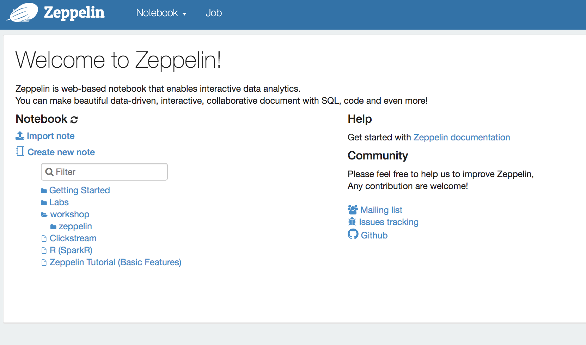
  
  - Click on the **Gear** icon at the top right corner. This opens up the list of interpreters. Click Save and exit. This will initialize all the interpreters.
  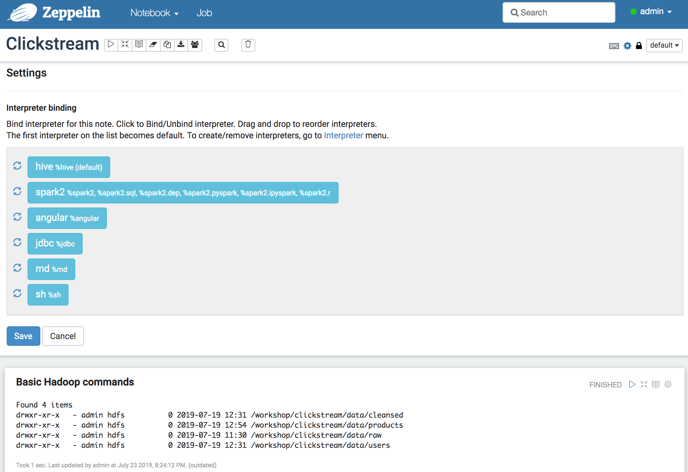
  
  - Perform the following steps to get familiarized with Zeppelin notebooks and the interpreters we will use in this lab to inspect HDFS directories and create Hive tables.   

    - Using a shell interpreter (%s), execute the following HDFS commands. You can use one paragraph for each command to execute the below commands. You can view the HDFS directories and the files that were ingested for creating hive tables we will use in the lab.
    ```
     hdfs dfs -ls /workshop/clickstream/data
     hdfs dfs -ls /workshop/clickstream/data/products
     hdfs dfs -ls /workshop/clickstream/data/users
    ```   
    
    - Using a hive interpreter (%hive), execute the following SQL statements. You can use one paragraph for each command to execute the below commands.
    ```
    # Create a database in Hive
    CREATE DATABASE IF NOT EXISTS clickstream
    USE clickstream
    
    # Create a users table with a schema on top of the users.tsv file in HDFS
    # DROP TABLE IF EXISTS users
     
    CREATE EXTERNAL TABLE IF NOT EXISTS users 
    (swid string, birth_dt string, gender_cd string) 
    ROW FORMAT DELIMITED FIELDS TERMINATED BY '\t' STORED AS TEXTFILE 
    LOCATION "/workshop/clickstream/data/users" 
    
    # Confirm the table was created with the data loaded by executing a select statement on the table 
    SELECT * FROM users limit 10 
    
    # Create a users_orc table using the users table created in previous step using a CTAS statement. 
    # The ORC format is an Optimized Row Columnar format that speeds up the query response 
    # DROP TABLE IF EXISTS users_orc; 
    CREATE TABLE IF NOT EXISTS users_orc as 
    SELECT * FROM users 
    
    # Confirm the table was created with the data loaded by executing a select statement on the table 
    SELECT * FROM users_orc limit 10 
    
    # Create a users table with a schema on top of the products.tsv file in HDFS 
    # DROP TABLE IF EXISTS products
     
    CREATE EXTERNAL TABLE IF NOT EXISTS products 
    (url string, category string, description string) 
    ROW FORMAT DELIMITED FIELDS TERMINATED BY '\t' STORED AS TEXTFILE 
    LOCATION "/workshop/clickstream/data/products" 
    
    # Confirm the table was created with the data loaded by executing a select statement on the table 
    SELECT * FROM products limit 10
    
    # Create a products_orc table using the products table created in previous step using a CTAS statement 
    # DROP TABLE IF EXISTS products_orc; 
    
    CREATE TABLE IF NOT EXISTS products_orc as 
    SELECT * FROM products 
    
    # Confirm the table was created with the data loaded by executing a select statement on the table 
    SELECT * FROM products_orc limit 10
    ```
    
  - This concludes the lab. In this lab we had the users.tsv and products.tsv data files were already moved to HDFS. We inspected that through the %s interpreter and created Hive tables using those files. We then created the corresponding ORC tables for them which are optimized for performance. We will use the ORC tables in NiFi to enrich click stream events with user information.
  


******
## Lab 4 - Enrich Clickstream Events with User Information for Downstream Analysis

In this lab, we will configure some more processors to enrich the in-flight streaming data with user information. For this we will use the user table in the hive database we created in the previous lab.

Go to the process group, where your nifi flow was built and perform the following steps:

- **Step 1: Configure a SelectHive3QL processor for querying user Data**   
   Drag a SelectHive3QL processor on the canvas. Double click on the processor. On the PROPERTIES tab perform the following configurations:
  - *Hive Database Connection Pooling Service* : Create a new service and select **Hive3ConnectionPool** from the options.
  - *HiveQL Pre-Query* : use workshop
  - *HiveQL Select Query* : select * from users_orc where users_orc.swid = '${user_session_id}'
  - On the SETTINGS tab, check the box for terminating the failure relationship.     
  - Apply changes.
  - Connect the **EvaluateJsonPath** processor configured earlier to the **SelectHive3QL** procssor for the *matched* and *unmatched* relationships.  
  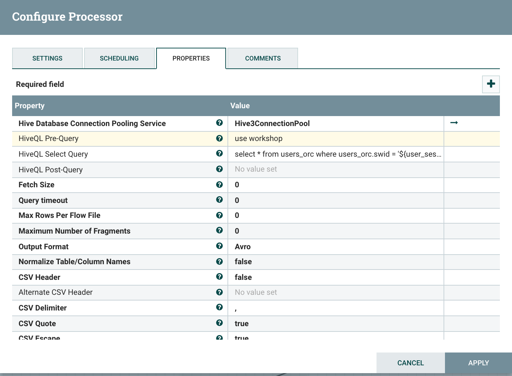  

     
- **Step 2: Configure a Hive3ConnectionPool Controller Service**   
   Open the Controller Services window for the process group from the Operate Window.
   Click on the gear icon for the **Hive3ConnectionPool** controller service and perform the following configurations:
  - *Database Connection URL* : jdbc:hive2://demo.cloudera.com:2181/;serviceDiscoveryMode=zooKeeper;zooKeeperNamespace=hiveserver2-interactive
  - *Hive Configuration Resources* : /etc/hive/conf/hive-site.xml
  - *Database User* : hive     
  - Apply changes and exit out of the controller services window.
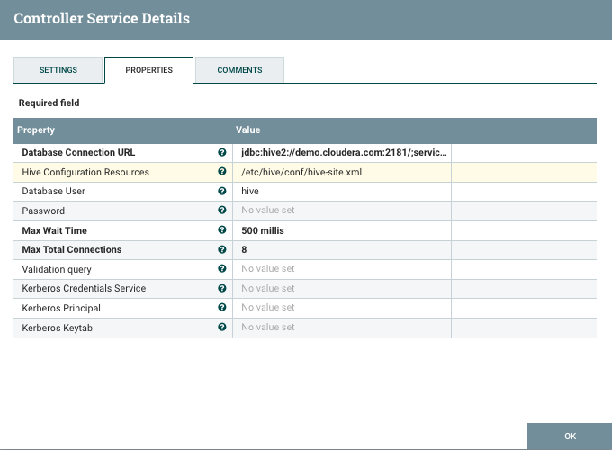
     
     
- **Step 3: Configure a ConvertAvroToJSON processor**   
The output from the query executed by the **SelectHive3QL** is in avro format. We will convert that into json, so we can extract the user data from the results of the query and assign them to the flowfile attributes.   

   - Drag a ConvertAvroToJSON processor on the canvas. 
     - Double click on the processor. On the SETTINGS tab, check the **failure** check box to terminate that relationship.
     - Leave the default property values as they are. Click APPLY and exit the processor.  
     - Connect the **SelectHive3QL** processor to the **ConvertAvroToJSON** processor using the success relationship.
   
- **Step 4: Configure a EvaluateJsonPath processor**   
   We will now extract the user data values from the json format result that the previous processor will output.
    
   Drag a EvaluateJsonPath processor on the canvas. Double click on the processor and perform the following configurations:
   - On the SETTINGS tab
     - **Name** : Extract user data from JSON
     - **Terminate Relationships** : check box for failure, matched and unmatched relationships.
   - On the PROPERTIES tab, add two properties: bday and gender and set values as follows:
     - *Destination* : flowfile-attribute
     - *bday* : $.birth_dt
     - *gender* : $.gender_cd
   - Click Apply
   - Connect the **ConvertAvroToJSON** processor to the **EvaluateJsonPath** processor using the success relationships.
   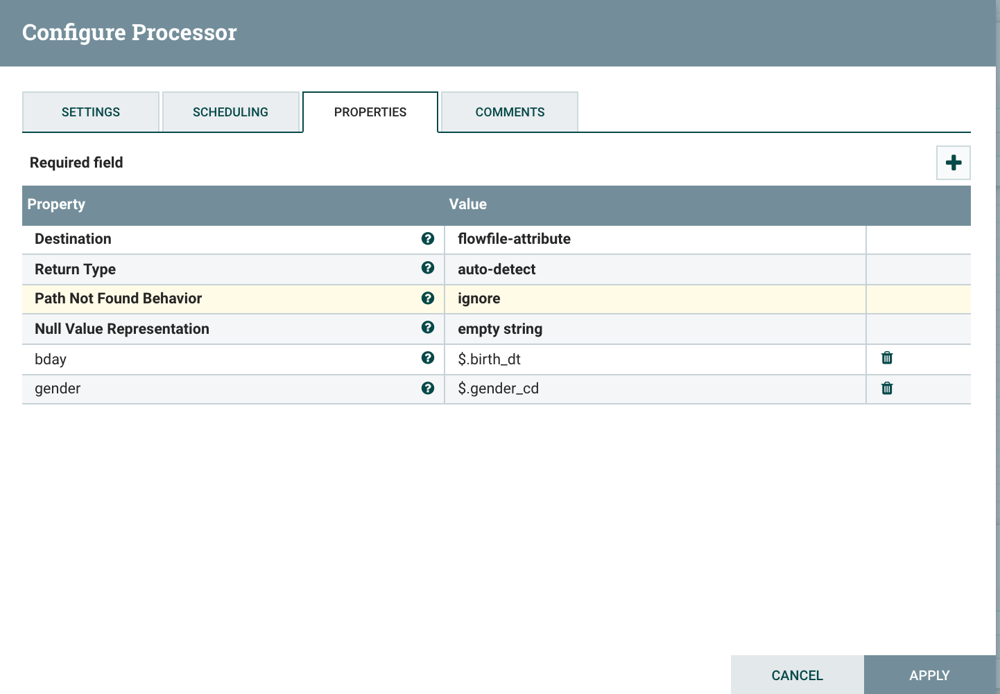
   
- **Step 5: Test the Flow**
We will now test the flow to check the results of our flow configuration. Perform the following steps:
  - Connect the **EvaluateJsonPath** to the funnel and disconnect it from the processor it was connected to earlier. Check the matched and unmatched relationships for the connection. Your flow should look now as below.
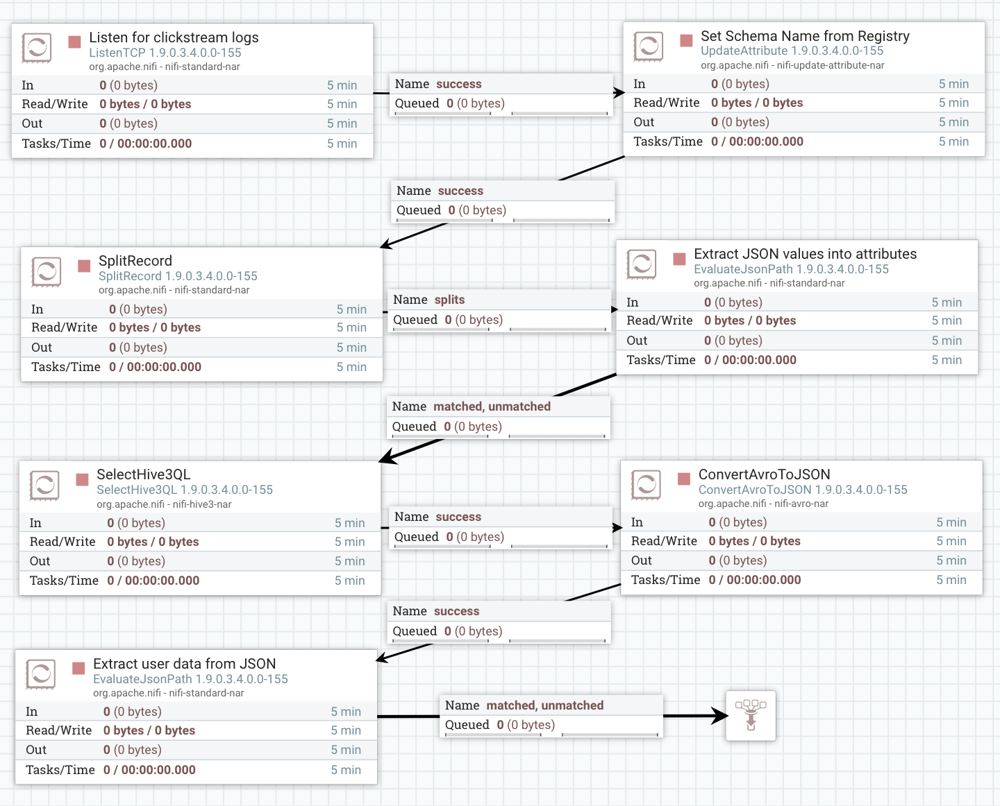
  
  - Click anywhere on the canvas (not on a processor) and click the configuration Gear in the Operate window. Go to the Controller Service tab and enable all the controller services. Exit out of the window.
  
  - Start all the processors in the flow by right-clicking on the canvas and selecting Start in the options menu. You can also start each processor individually if you want by right clicking on them and starting them.
  
  - Go to your ssh terminal window and execute the **publish-clickstream-to-nifi.sh** script to publish the clickstream data.
  
  - Go back to the Nifi flow. You should start seeing the data flowing between the processors.
  
  - Right Click on the last relationship connection, between the funnel and the EvaluateJsonPath processor and list the queue. Select the first message by clicking on the info icon.
  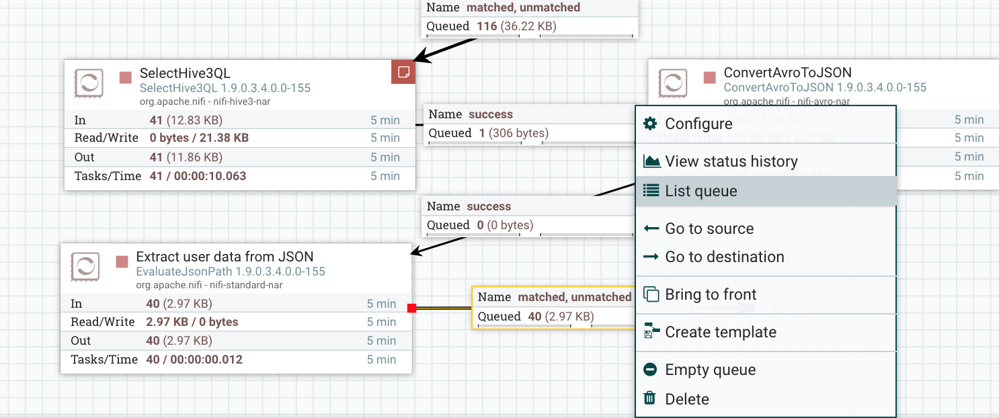
  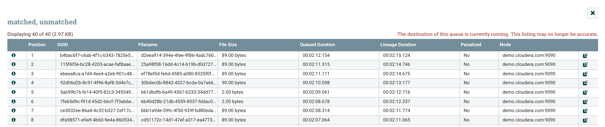
  
  - Inspect the contents by clicking the **VIEW** button on the **DETAILS** tab. You will see the results from the Users table query converted into json format. Click on the ATTRIBUTES tab. You will see the bdate and gender attributes have values extracted from the query results.
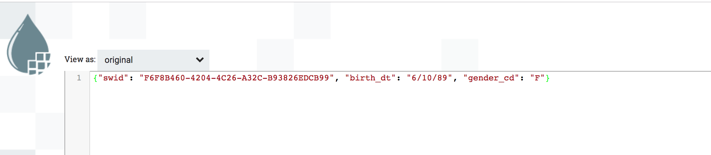
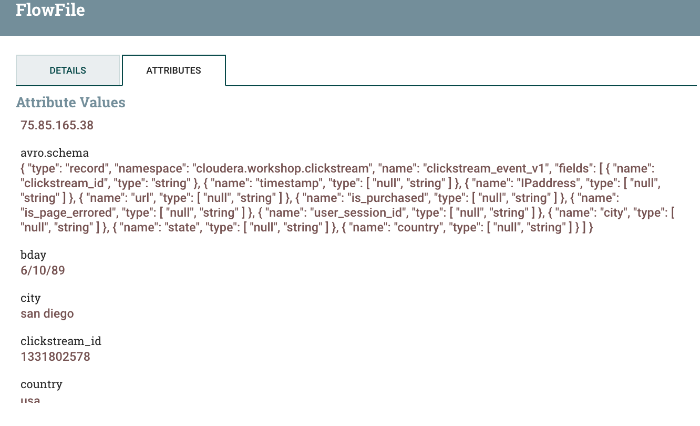

- **Step 6: Update flow in NiFi Flow Registry**
Since we have now achieved a substantial amount of flow to work, persist the flow in the NiFi Registry by right-clicking on the canvas, selecting the version option and selecting the "commit local changes".  
       
******
## Lab 5 - Explore Kafka

In this lab, we will explore basic functions of Kafka and the scripts available to interact with Kafka that come packaged with the Kafka installation binaries. We will use Kafka as our messaging layer in the later labs to publish clickstream events to it. Streaming applications built for real-time analytics generally consume streaming data from Kafka, with Kafka acting as a decoupling layer between the streaming data source and the streaming applications.

-  ssh to the AWS instance as explained above then become root

```sudo su -```

-  Navigate to Kafka

```cd /usr/hdp/current/kafka-broker```

-  Create a topic named **clickstream_events_test**

```./bin/kafka-topics.sh --create --zookeeper demo.cloudera.com:2181 --replication-factor 1 --partitions 1 --topic clickstream_events```

-  List topics to check that it's been created

```./bin/kafka-topics.sh --list --zookeeper demo.cloudera.com:2181```

-  Open a consumer so later we can monitor and verify that JSON records will stream through this topic:

```./bin/kafka-console-consumer.sh --bootstrap-server demo.cloudera.com:6667 --topic clickstream_events```

  Keep this terminal open.

-  We will now open a new terminal to publish some messages...
Follow the same steps as above except for the last step where we are going to open a producer instead of a consumer:

```./bin/kafka-console-producer.sh --broker-list demo.cloudera.com:6667 --topic clickstream_events```

Type anything and click enter. Then go back to the first terminal with the consumer running. You should see the same message get displayed!

******
## Lab 6 - Publish Enriched Clickstream Events to Kafka and ingest into Druid
In this lab we will add a few more attributes to the click stream event data that are necessary for sending the event data into Druid for aggregation and then convert the attributes of the flow file into json content of the flow file. We will then publish the data to Kafka. 

We will then create a table in Druid through the hive interface and initiate data ingestion into Druid.

- **Step 1: Add UpdateAttribute Processor**   
We will first add the **UpdateAttribute** processor with an attribute that we will name as `__time`. This will be used to store the timestamp value. Since we will be using Druid as the database to store clickstream time series data, we need this attribute named as such as per Druid's requirement to store time series data.   

   Although, the clickstream event also has a time stamp value that we could have extracted and stored that value in the `__time` attribute, to demonstrate the NiFi's built in functions within its [expression language](https://nifi.apache.org/docs/nifi-docs/html/expression-language-guide.html), we will use the `now()` function to generate a timestamp value and format it the way we want.   

   Configure the **UpdateAttribute** processor as follows:   
   - On the ATTRIBUTES tab,   
     - add the property `__time`
     - Assign its value: `${now():format("yyyy-MM-dd'T'HH:mm:ss'Z'", "America,Chicago")}`   
     
   - On the SETTINGS tab set the properties as follows   
     -  **NAME** : `Add __time attribute`  
     
     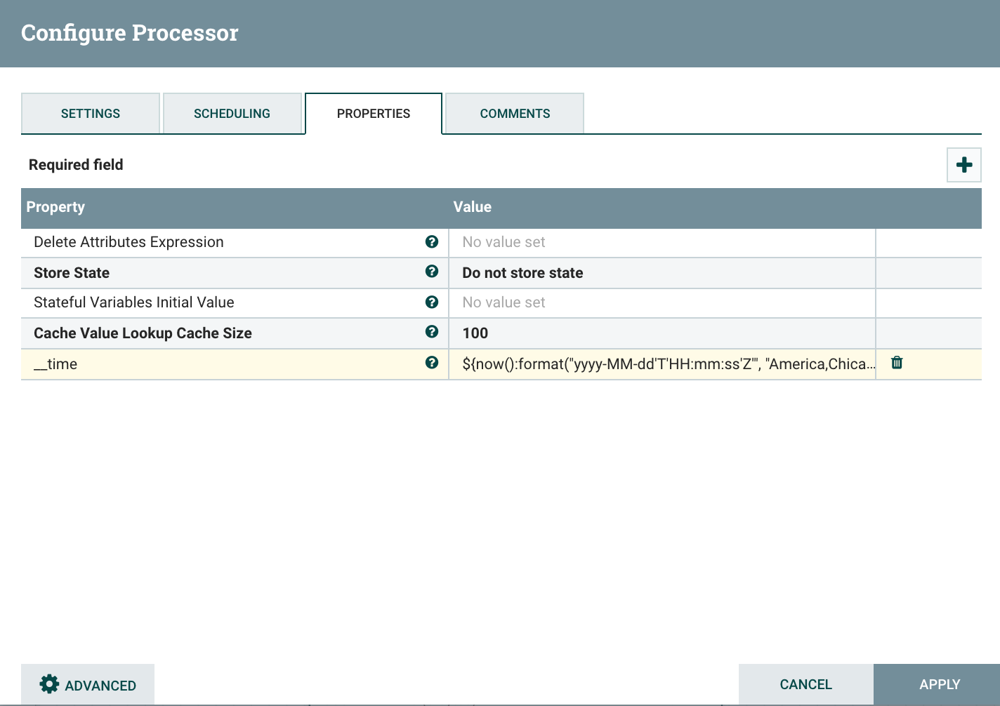   
     
   - Click APPLY and exit out of the configuration window.   
     
   - Link **EvaluateJSONPath(Extract user data from JSON)** processor to the **UpdateAttribute** processor using the **matched and unmatched** relationship paths.
    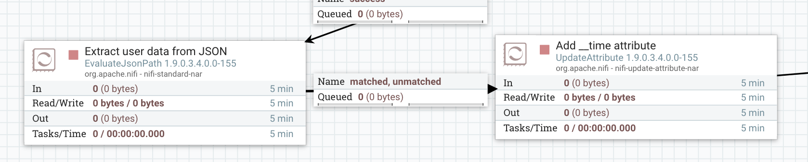

- **Step 2: Add AttributesToJSON Processor**   
Every attribute that we have added to any processor in the flow we built will be attached to the flow file. We need to now recreate flow file content with all the attributes we collected so far along with their values. For this we will use the **AttributesToJSON** processor.   

   - Add an **AttributesToJSON** processor to the canvas
   - Double click on the processor
   - On SETTINGS tab, click on all relationships
   - On PROPERTIES tab:
      - Change **Attributes List** value to ***__time,clickstream_id,user_session_id,IPaddress,ts,gender,bday,is_purchased,is_page_errored,url,city,state,country***
      - Change **Destination** value to **flowfile-content**
      - Appliy changes
      - Connect **UpdateAttribute** processor to **AttributesToJSON** processor through the **success** relationship.
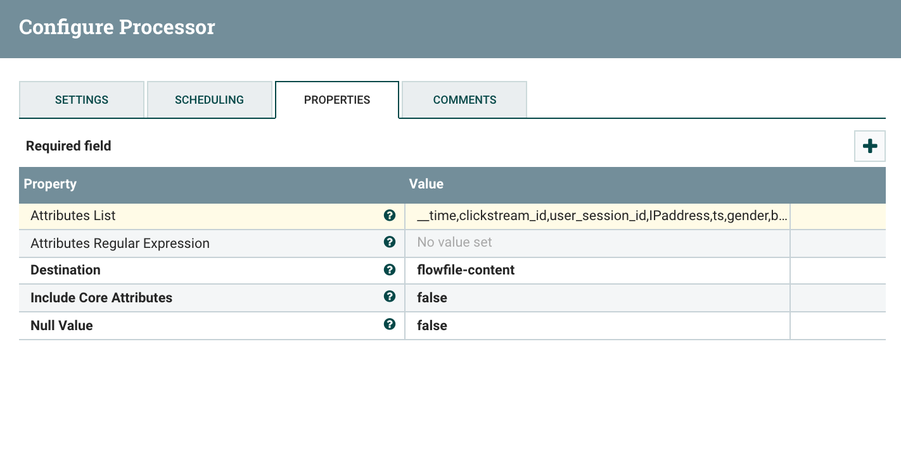


- **Step 3: Add PublishKafka_2_0 Processor**   
   We will now publish the JSON contents created in the previous processor to Kafka. You worked in the previous lab on Kafka and explored how messages can be published and consumed from Kafka. In NiFi we have Kafka connectors using which, through simple configurations, messages can be published and consumed from Kafka.

   - Add **PublishKafka_2_0** connector to the canvas and link from QueryRecord on **comments_in_english** relationship
  - Double click on the processor
  - On settings tab, check all relationships
  - On properties tab
  - Change **Kafka Brokers** value to **demo.cloudera.com:6667**
  - Change **Topic Name** value to **clickstream_events**
  - Change **Use Transactions** value to **false**
  - Apply changes
  - Connect the **AttributesToJSON** processor to the **PublishKafka_2_0** processor using the **success** relationship.
  - Disconnect funnel from the processor it was connected to and connect it to the **PublishKafka_2_0** processor.   

The flow should look like this:

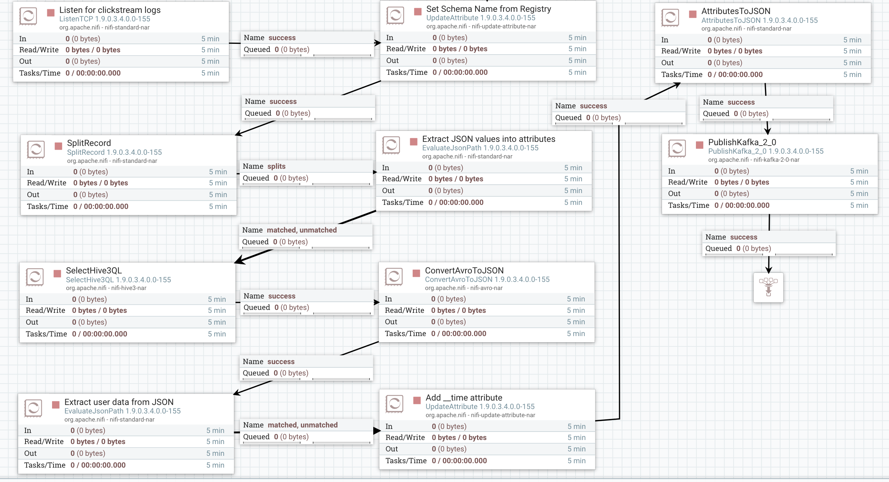

Again commit your changes and start the flow!

You should be able to see records streaming through Kafka looking at the terminal with Kafka consumer opened earlier. 
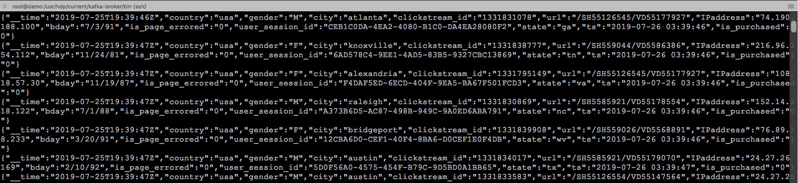

When you are happy with the outcome stop the flow and purge the Kafka topic as we are going to use it later:

```./bin/kafka-configs.sh --zookeeper demo.cloudera.com:2181 --entity-type topics --alter --entity-name clickstream_events --add-config retention.ms=1000```

Wait for few second and set the retention back to one hour:

```./bin/kafka-configs.sh --zookeeper demo.cloudera.com:2181 --entity-type topics --alter --entity-name clickstream_events --add-config retention.ms=3600000```

You can check if the retention was set properly:

```./bin/kafka-configs.sh --zookeeper demo.cloudera.com:2181 --describe --entity-type topics --entity-name clickstream_events```

********
## Lab 7 - Ingest clickstream_events into Druid

Visit [Zeppelin](http://demo.cloudera.com:9995/) and log in as admin (password: admin)

Go back to your notebook that you used in the previous lab.

Create the Hive table backed by Druid storage where the clickstream_events data will be streamed into

```SQL
CREATE EXTERNAL TABLE workshop.clickstream_events (
`__time` timestamp,
clickstream_id string,
user_session_id string,
ipaddress string,
ts string,
gender string,
bday string,
is_purchased string,
is_page_errored string,
url string,
city string,
state string,
country string
)
STORED BY 'org.apache.hadoop.hive.druid.DruidStorageHandler'
TBLPROPERTIES (
"kafka.bootstrap.servers" = "demo.cloudera.com:6667",
"kafka.topic" = "clickstream_events",
"druid.kafka.ingestion.useEarliestOffset" = "true",
"druid.kafka.ingestion.maxRowsInMemory" = "5",
"druid.kafka.ingestion.startDelay" = "PT1S",
"druid.kafka.ingestion.period" = "PT1S",
"druid.kafka.ingestion.consumer.retries" = "2"
)
```

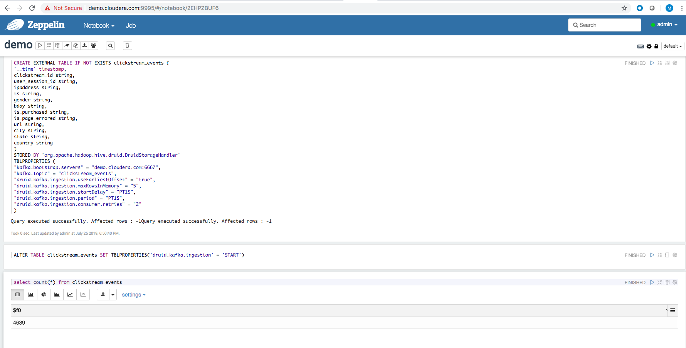

Start Druid indexing

```SQL
ALTER TABLE workshop.clickstream_events SET TBLPROPERTIES('druid.kafka.ingestion' = 'START')
```

Verify that supervisor and indexing task are running from the [Druid overload console](http://demo.cloudera.com:8090/console.html)


You can now start publishing data using the script to the NiFi flow. The data that gets published to Kafka in NiFi now automatically gets ingested into Druid allowing us to query the data streamed in real-time.

## Lab 8 - Create Live Dashboard with Superset

Go to [Superset UI](http://demo.cloudera.com:9088/)

Log in with user **admin** and password **admin**   

  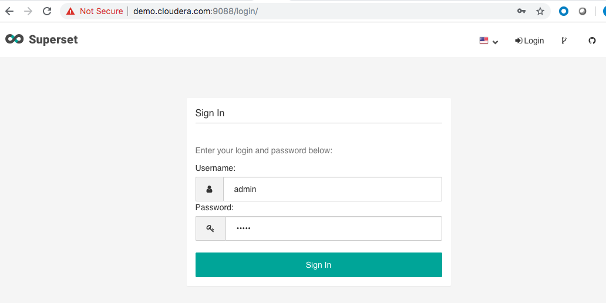

Refresh Druid metadata   

   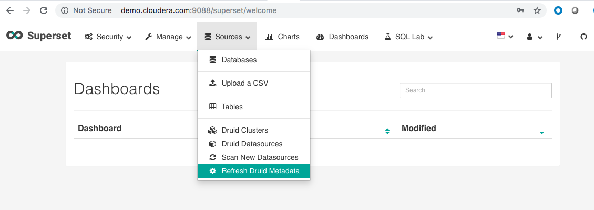

Edit the **workshop.clickstream_events** datasource record and verify that the columns are listed, same for the metric (you might need to scroll down)

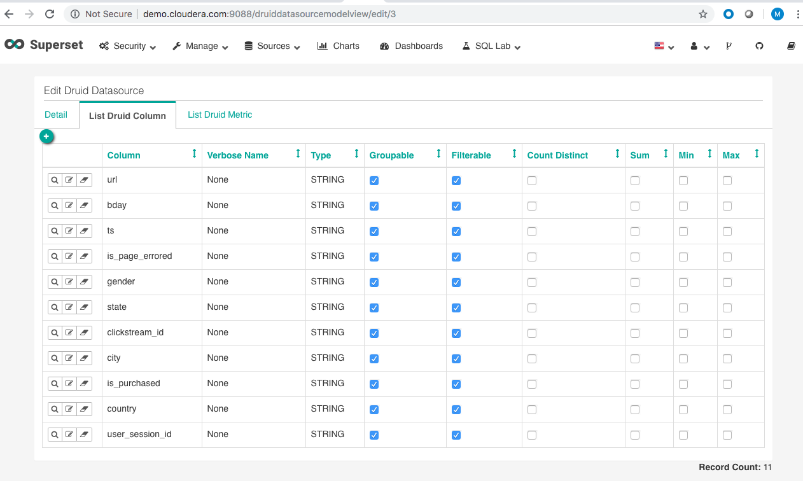   

- **Slice-1 Build the Top 25 product hits visualization**   
   - Click on the datasource and create the following query   
   
   
   
   - From this slice, create a dashboard as shown.   
   
   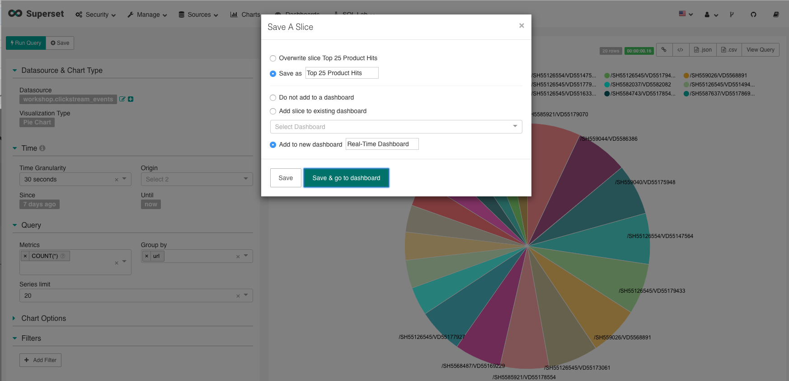   
   
   Resize the Dashboard as required. From the **Actions** button, click on **Set Auto Refresh** interval to 10 seconds. You will now see this dashboard update in real-time as the data gets ingested into Druid in Real-Time.
   
   You can build several other **slices** from the datasource as below and add them to the dashboard.
   
- **Slice-2 Distribution of Product clicks by State**   
   
   - Click on the datasource and create the following query   
   
   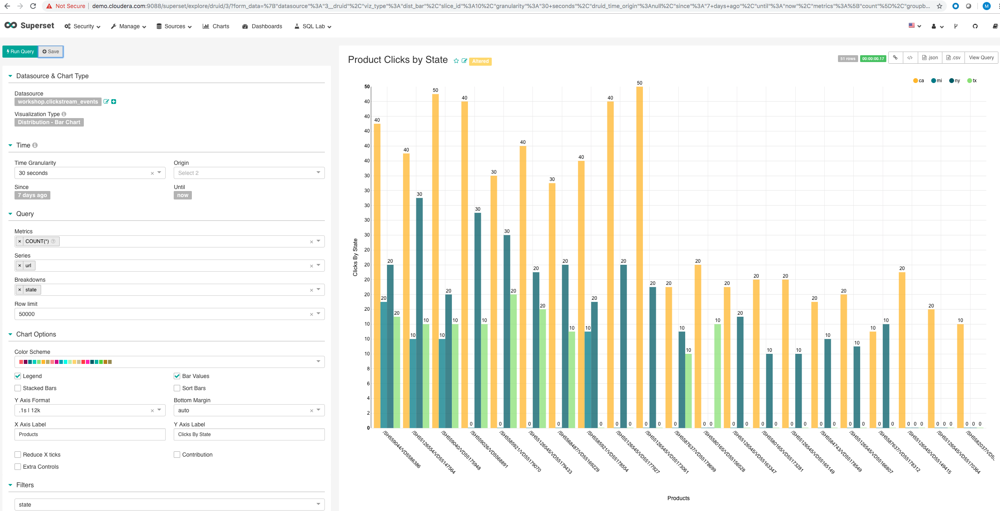
   
   - You can add filters to the query as shown below to limit what you want to visualize.   
   
   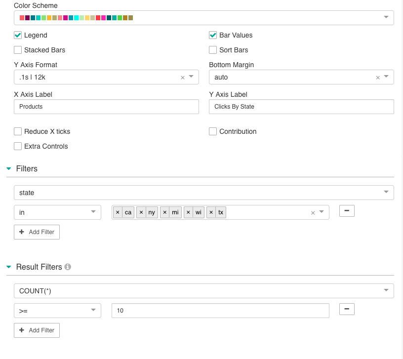
   
   - Save the query and add to dashboard.
   
   -Resize the Dashboard as required as save. If you had setup the refresh rate, you will now see this slice getting updated in real-time as well.   
   
   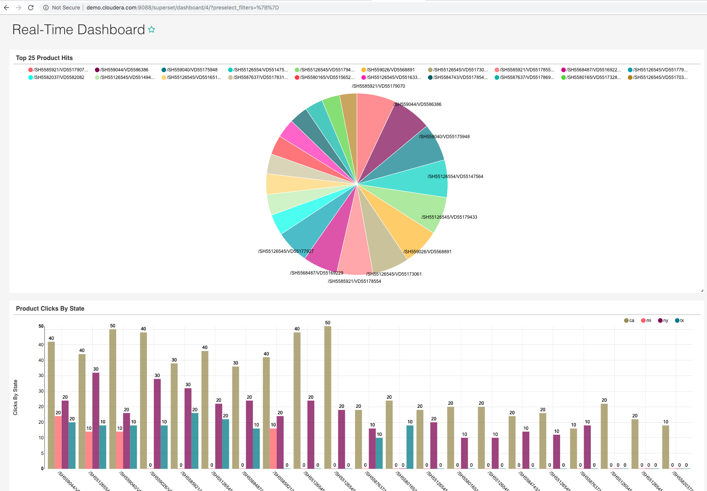
   
- **Slice-3 Distribution of Product clicks by State - Sankey Chart**
   
   - Create a Sankey Visualization from the clickstream events data   
   
   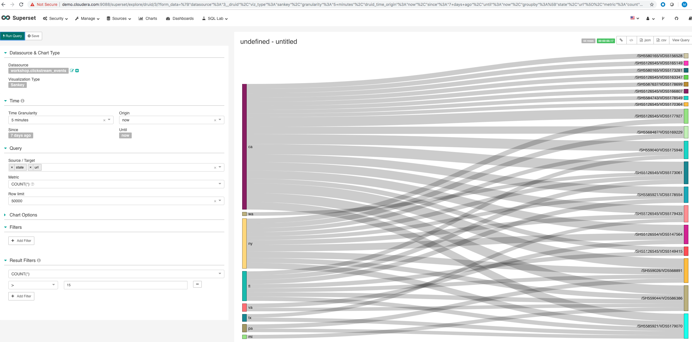
   
   - Add it to the dashboard.


- **Slice-4 Web Application Clicks By State - Heat Map**
   
   - Create a Heat Map Visualization from the clickstream events data   
   
   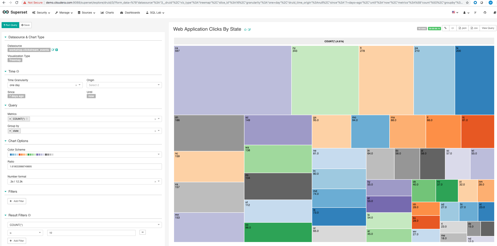
   
   - Add it to the dashboard.   

   - Your dashboard may look like here   
   
   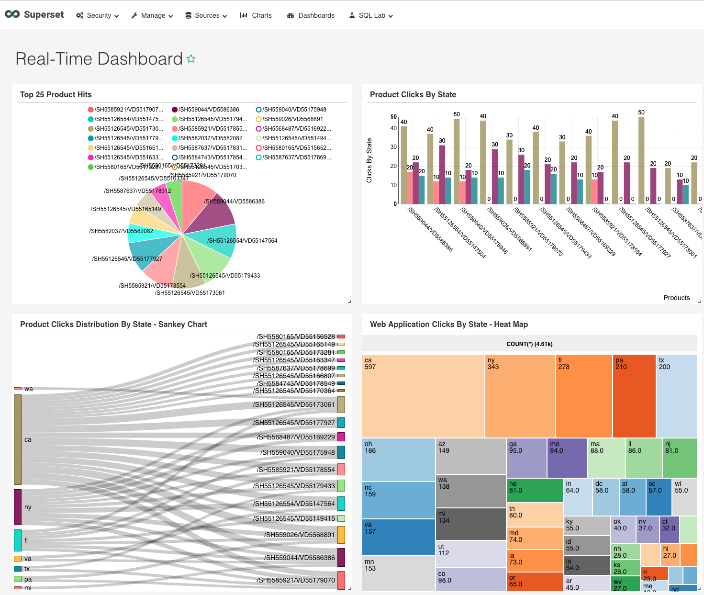
   
- You can add more slices to do product segmentation across demographics (gender for example or by age) to get more insights and in real-time or daily to see the trends over time. 
   
   
******
## Lab 9 - Collect clickstream events data using MiNiFi and EFM

While we saw one way of collecting data using a direct TCP connection within NiFi, this may in general not be feasible when your applications are deployed, for example in the cloud or outside your enterprise. In such a situation, we can use minifi as a very light-footprint agent on the web application servers and capture the streaming data from the log files that the web applications write to and stream that over to NiFi.

In this lab, we are going to see how minifi can be used to collect this data from remote applications. We are also going to see how CEM (Cloudera's Edge Managent) tool can be used to manage the remote agents as well as to do the deployments of flows to minifi agents.

Perform the following Steps for the lab:

- **Step 1: Start the minifi agent and the efm service**   

   - Go to NiFi Registry and create a bucket named **demo**
   - As root (sudo su -) start EFM and MiNiFi

```bash
service efm start
service minifi start
```
   - Visit [EFM UI](http://demo.cloudera.com:10080/efm/ui/). You should see heartbeats coming from the agent   
      
   
- **Step 2: Build the NiFi Flow to receive data from MiniFi**   

   Before we configure MiniFi to send data to NiFi, we must build the receiving flow in NiFi first. Perform the following steps.   
   
   - Add an **Input Port** to the **root canvas** of NiFi. Input Ports are used to receive flow files from remote MiNiFi agents or other NiFi instances.   
   
   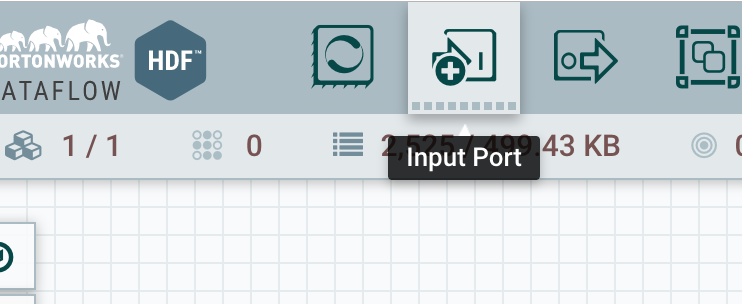   
   
   - Double click on the input port and change the **Name** of the input port as **minifi-clickstream-events**   
   
      
   
   - Connect it to a funnel.   
   
   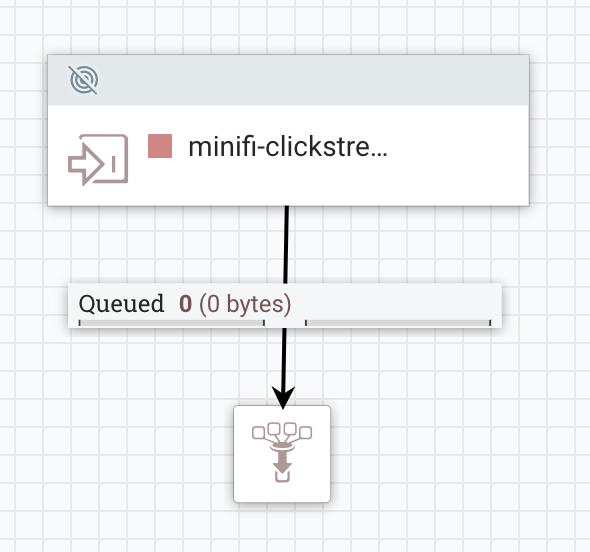   
   
- **Step 3: Update your main NiFi flow to receive data from root canvas flow**   

   Since our main NiFi flow is in a process group, we need to enable this flow to receive data from the root canvas flows. Perform the following steps.   
   
   - Add an Input Port to the canvas within your Process Group where we built the main NiFi flow. Name the input flow as **from_minifi**   
   
   - Connect the Input Port to the **UpdateAttribute** processor which we named as *Set Schema Name from Registry* via a funnel as shown in the figure below.
   
   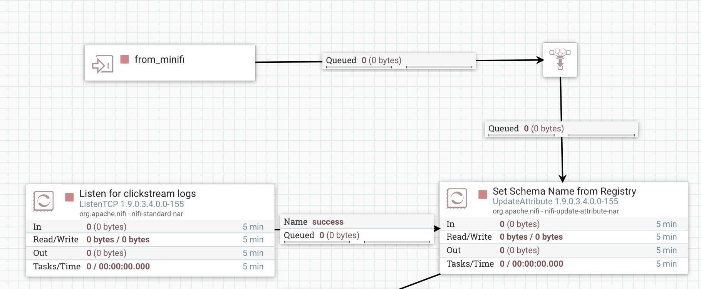

   - Connect the **ListenTCP** processor to the funnel and delete its connection with the **UpdateAttribute** processor. See the figure below for the final result.
   
   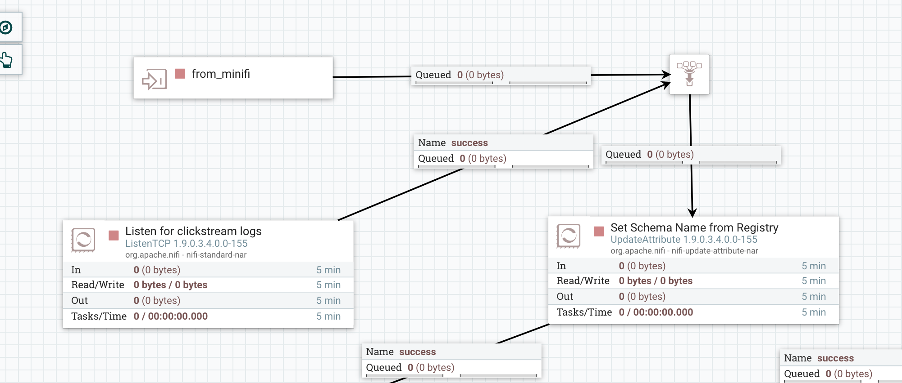 
   
   - Go back to the root canvas and connect the Input Port via funnel to the *process group* **clickstream-flow** or whatever you named your flow that was built earlier as shown.
   
   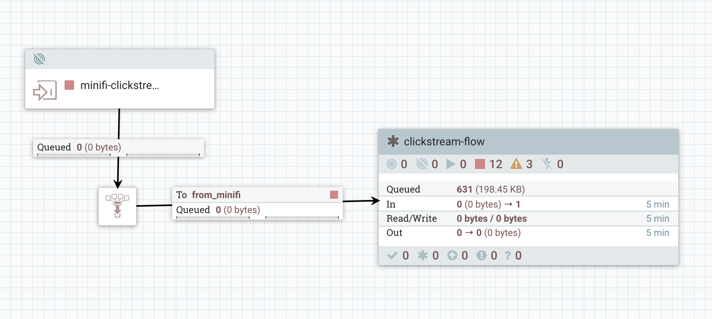   
   
- **Step 4: Build the MiniFi flow in EFM**   

   Now that our NiFi flow is ready to receive data from MiNiFi, let us configure the MiNiFi flow. This MiNiFi agent will tail the file located at `/home/centos/cdf-workshop-master/data/weblogs/weblogs.log` and send the logs to the **Input Port** we configured on the **root canvas** earlier. The script `write-clickstream-to-file.sh` will write the clickstream data to this directory.   
     
   .   
   
   Follow the below steps to create the flow for the MiNiFi agent.   
   
   - Go to [EFM UI](http://demo.cloudera.com:10080/efm/ui/)
   
   - Our agent has been tagged with the class 'demo' (check nifi.c2.agent.class property in /usr/minifi/conf/bootstrap.conf) so we are going to create a template under this specific class.  
   
   - Click on the **checkered menu** and select the **demo** template. This will take you to the **Flow  Designer**. On the canvas, add a processor by dragging the processor to the canvas. A list of processors available to configure are displayed. In the filter, type in **tail**. This will filter out the rest and show the **TailFile** processor. Select this processor and configure it.
   
      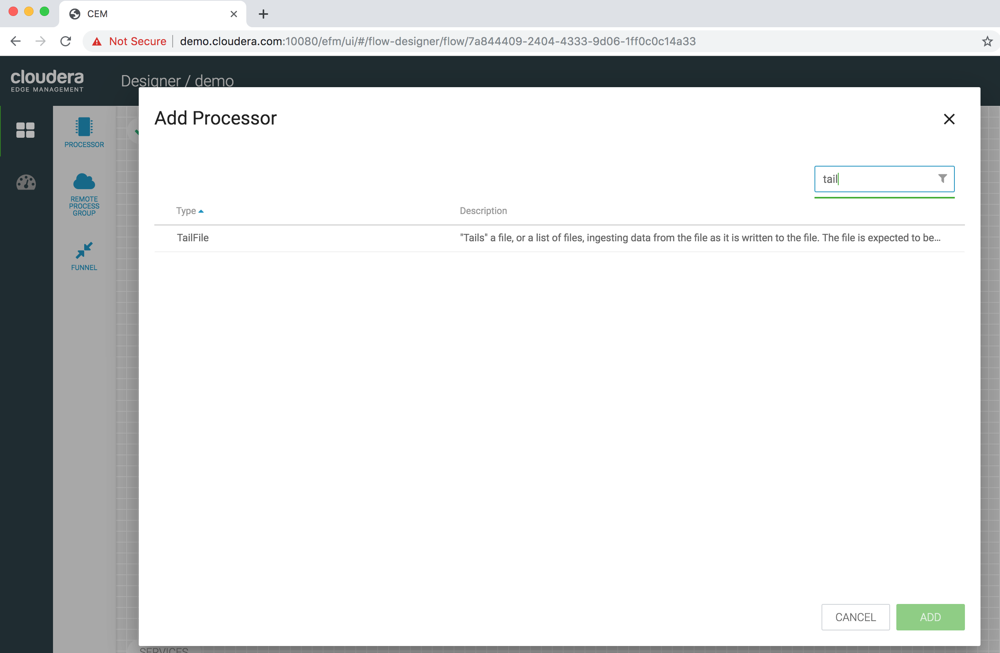
      
   - Configure the properties for the processor as follows:   
     - **PROCESSOR NAME** : TailFile-weblogs
     - Properties:
     	- **Tailing mode** : Single File
     	- **File(s) to tail** : /home/centos/cdf-workshop-master/data/weblogs/weblogs.log
     	- **Initial Start Position** : Beginning of File
     - Leave the rest as default values, Click APPLY and exit.
     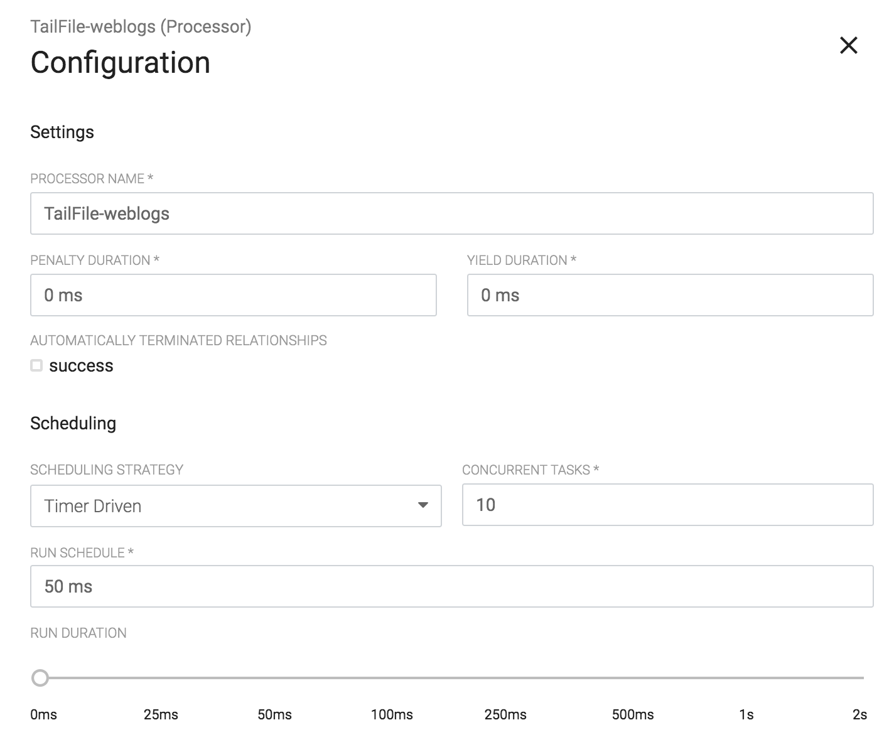
     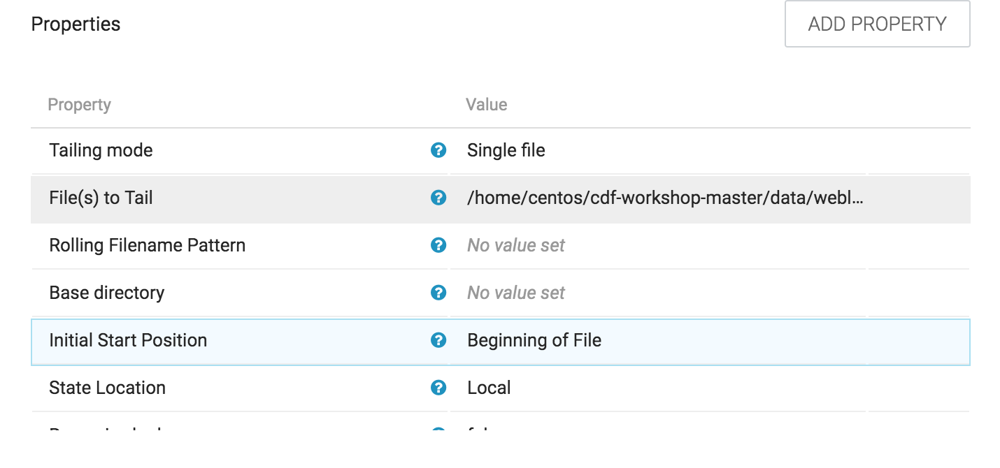   
     
    - Add a **Remote Group Processor** to the canvas. Input the URL as **http://demo.cloudera.com:9090**, which is the URL for our NiFi UI.
     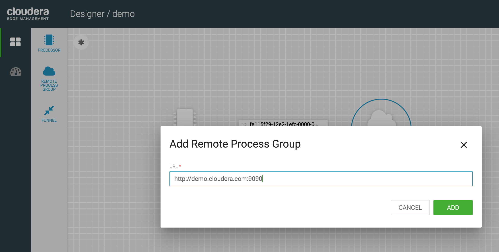   
     
      - Double click on the **Remote Process Group** component on the canvas, and make sure the **TRANSPORT PROTOCOL** property is set to **HTTP**. Change it if is set to **RAW**. Leave the rest of the properties as default values and exit.   
      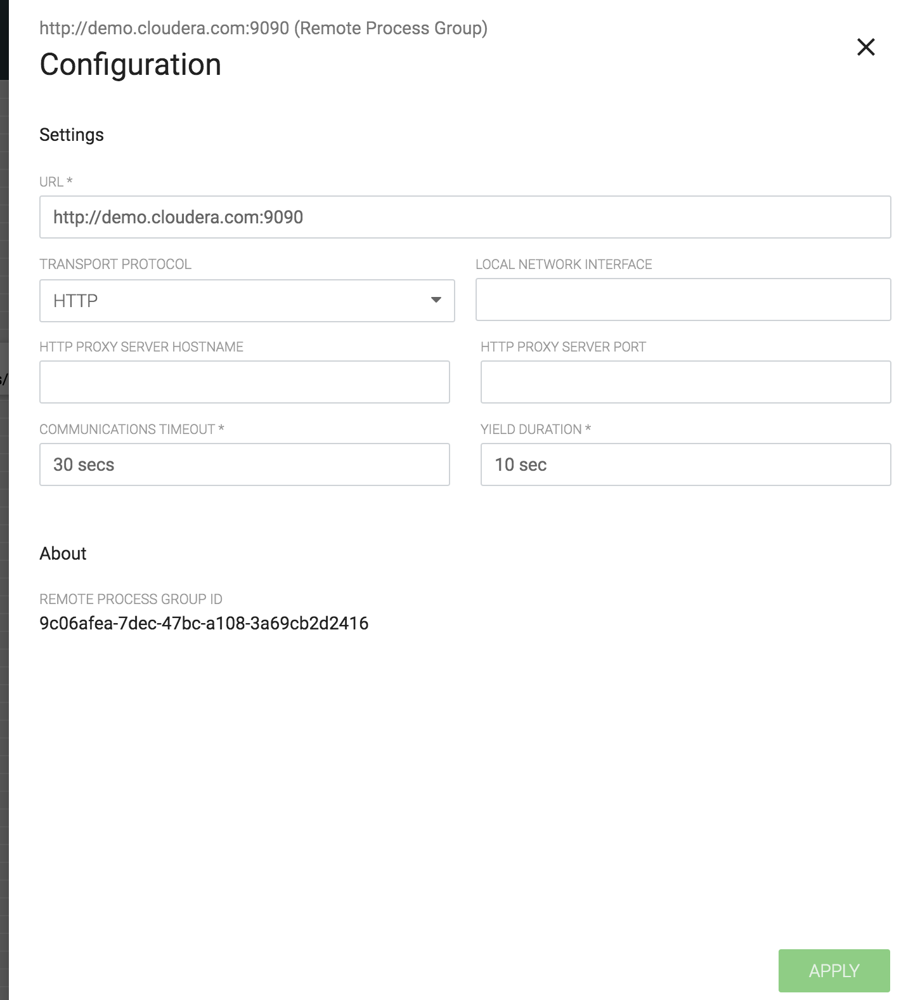   
      
    - Connect the **TailFile-weblogs** processor with the **RemoteProcessGroup**. A connection dialog pops up, asking to provide the ***Destination Port Id***   
    
     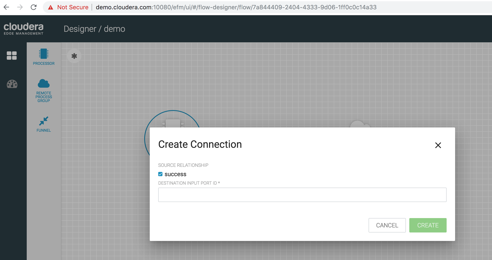   
     
     - Go to the NiFi UI (http://demo.cloudera.com:9090) if it is open in another window or open one and go to the **root canvas**. Double-click on the **Input Port** we configured (called as *minifi-clickstream-events*), and copy the **Id** value from the configuration window. Input that value as the ***Destination Port Id*** in the connection dialog that popped up in the previous step.   
       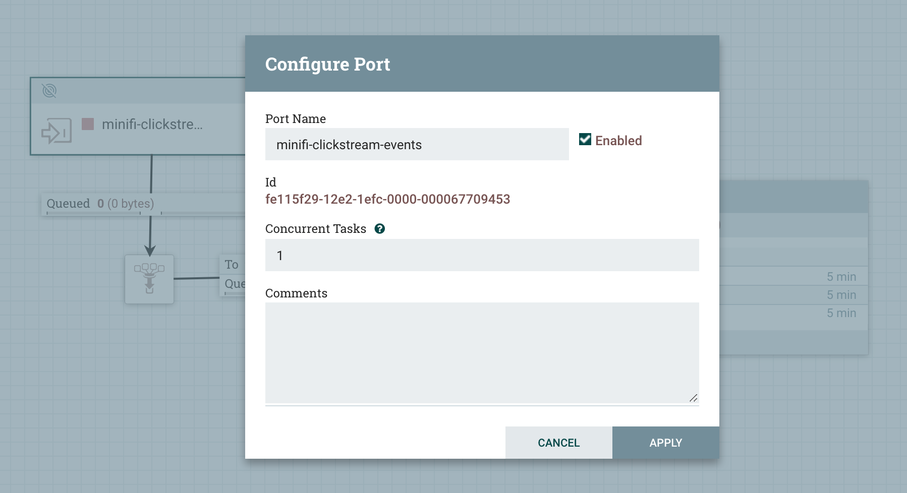
     
    - Your final MiNiFi flow should look as below. The **asterisk or Star** at the upper left corner of the window indicates that it has not yet been published to the MiNiFi agent. To publish it to the MiniFi agent, we first publish it to the NiFi Registry. Once it is published there, it automatically publishes the flow to all the MiNiFi agents that belong to the ***demo*** class.   
    
     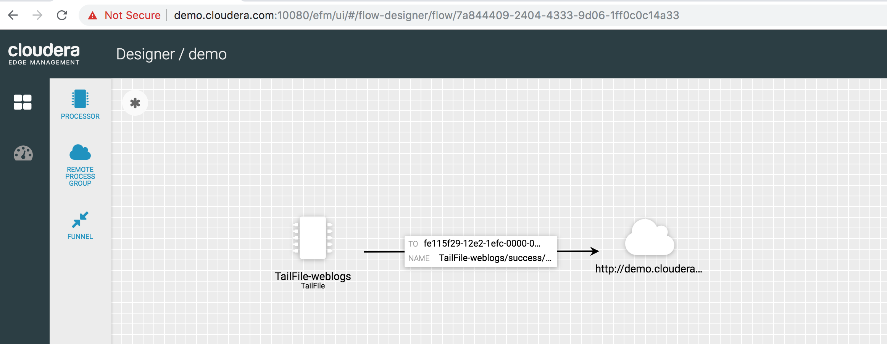
     
    - Double-click on the connection to check the details of the configuration.
    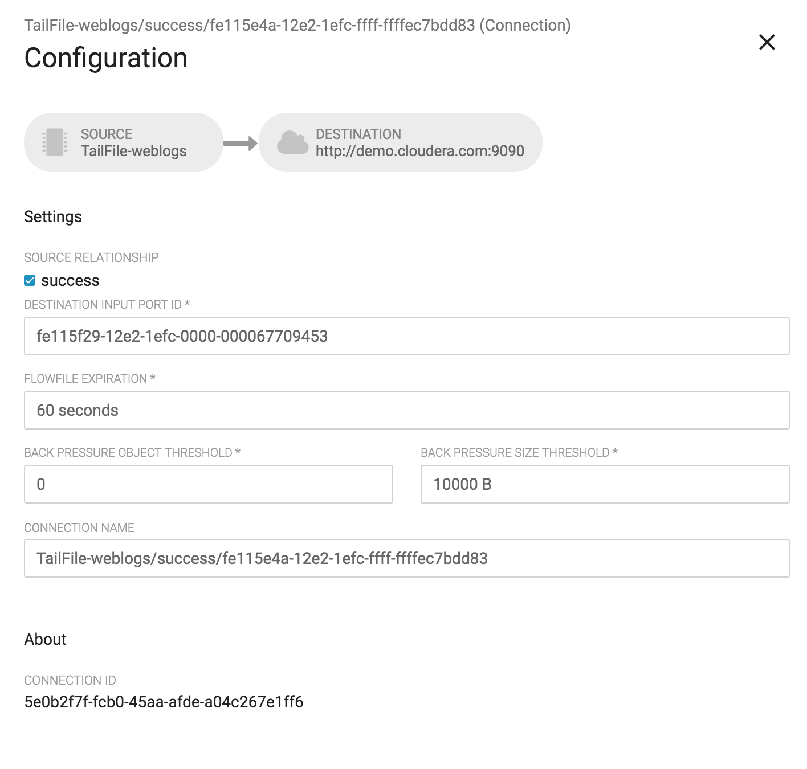
       
     
    - Select **Actions** from the upper right corner and click on **Publish** to publish the flow to NiFi Registry. If successful, the **Star** Icon will change to a **Green Check** icon. This action also publishes the flow to all the MiNiFi agents that are deployed on all the servers - in our case on the sandbox server.  
    
     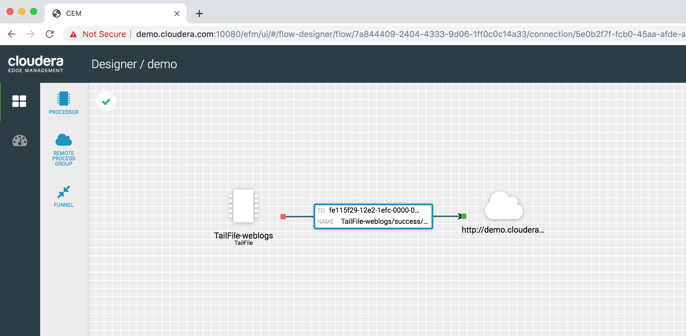   
  
- **Step 5: Test the flow from MiNiFi to NiFi to Kafka to Druid to Superset**       

   In our final step, we will test flow end-to-end. Follow the below steps:
   
   - In your ssh terminal window from the `/home/centos/cdf-workshop-master/data_gen` directory, execute the shell script `./write-clickstream-to-file.sh`. This will start generating the clickstream data which will be written to the `weblogs.log` file located at the `/home/centos/cdf-workshop-master/data/weblogs` directory. 
   
   - The MiNiFi agent is already running and will start tailing the weblogs.log file. From the root canvas in the NiFi UI (http://demo.cloudera.com), start the Input Port, the clickstream-flow process group. Now we can start the NiFi flow and publish the MiNiFi flow to NiFi registry (Actions > Publish...).  Visit [NiFi Registry UI](http://demo.cloudera.com:61080/nifi-registry/explorer/grid-list) to make sure your flow has been published successfully.   
   
   .   
   
   Within few seconds, you should be able to see Weblog messages streaming through the NiFi flow and published to the Kafka topic we had created. Data will be continuously ingested into the Druid data source we created and you will be able to see your dashboard getting updated in real-time.
   
   **This concludes our lab**


## Bonus - Lab 10 - Stream enhanced data into Hive using NiFi


